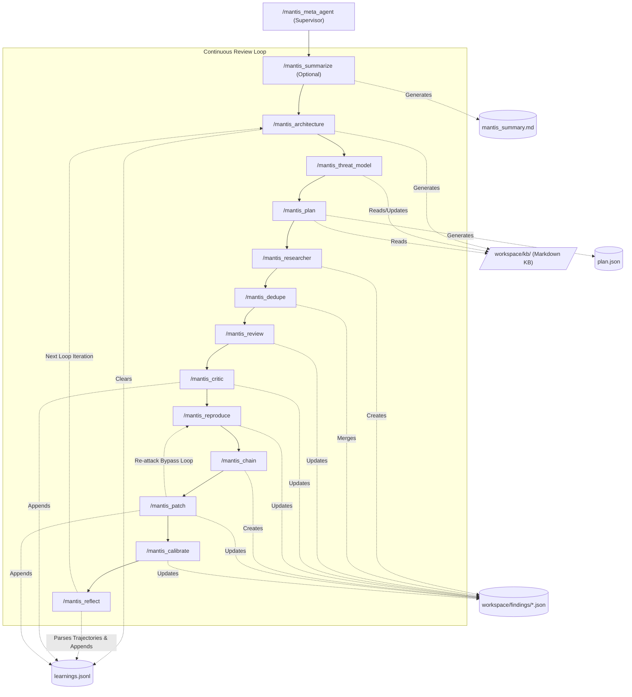

# Mantis Skills: Portable Toolkit for Building Security Review Harnesses

> [!CAUTION] **USE AT YOUR OWN RISK. BE EXTREMELY CAREFUL.** This suite is
> designed to generate and execute autonomously generated code that may be
> unstable or perform unexpected actions. **USE THIS ONLY IN ISOLATED,
> RESTRICTED ENVIRONMENTS.** Never run this suite on a machine with access to
> production systems, sensitive data, or internal networks. See the "Unattended
> Cloud Deployment" section for mandatory hardening requirements.

> [!IMPORTANT] **RESPONSIBLE USE** AI models are non-deterministic and can
> hallucinate findings or generate incorrect patches. **All findings must be
> manually verified by a security expert before being reported.** Do not
> mass-file unverified, AI-generated reports to open-source maintainers. A
> failure to automatically reproduce a vulnerability does not definitively mean
> it is a false positive, nor does a successful reproducer guarantee the bug is
> exploitable in all contexts. Use these skills responsibly.

Mantis Skills is a decoupled, sequential, and security-focused set of **Skills**
designed for use with Coding Agents. It is intended to be a **flexible
foundation and starting point** rather than a rigid set of instructions. You
should adapt, tune, and extend these skills to fit your organization's specific
software or hardware stack.

For example, while the default skills will look for generic security issues,
business logic problems, and authorization vulnerabilities, they can be adapted
for:

*   **Hardware / RTL Reviews**: Auditing Register-Transfer Level (RTL) designs
    (SystemVerilog, VHDL) for security properties or logical bugs.
*   **Infrastructure-as-Code (IaC)**: Analyzing cloud deployment boundaries,
    Terraform state, or Kubernetes RBAC configurations for privilege escalation
    paths.
*   **Data & ML Pipelines**: Auditing training data ingress, model serialization
    formats (e.g., Pickle vulnerabilities), or boundary constraints between data
    science notebooks and production.
*   **Compiled Binaries & Firmware (Gray-Box Auditing)**: Pointing the suite at
    compiled release artifacts (using tools like `unblob`, `Ghidra`, `radare2`,
    `qemu`, or `unicorn`) without providing source code. The intent of this mode
    is to emulate a third-party security researcher, allowing you to see exactly
    what vulnerabilities are discoverable by adversaries who only have access to
    your released binaries.
*   **Custom Test Environments**: Replacing the default container reproduction
    stage with isolated VMs, physical hardware testbeds (via USB/serial), or
    custom simulators.

We strongly recommend using AI to iterate on these skills and using your
internal documentation, coding standards, and build systems to augment the
threat model. We also strongly recommend adapting risk calibration to your
environment and risk tolerance.

For more information on securing AI systems, see Google's
[Secure AI Framework (SAIF)](https://safety.google/safety/saif/).

This suite enables anyone with an agentic coding tool to systematically review,
deduplicate, validate, criticize, reproduce, and patch codebases of any scale.
It also features a continuous learning loop that allows the suite to adapt
across iterative runs and avoid redundant analysis.

Above all, while orchestrated vulnerability discovery is incredibly powerful and
useful, it is even more important to use this in a suitably isolated environment
to prevent impacting production systems. See the notes on unattended cloud
deployment later in this guide.

--------------------------------------------------------------------------------

## Architecture and Sequential Flow

The pipeline is composed of ten distinct components (one supervisor and nine
execution stages), maintaining state across a directory of finding files
(`workspace/findings/*.json`). This entire process can be supervised
autonomously by the overarching **`/mantis_meta_agent`**.



1.  **`/mantis_meta_agent` (Supervisor):** A persistent, overarching agent that
    launches the continuous loop, monitors execution, handles errors, reports
    findings, and archives the `workspace/findings/` directory between loops.
2.  **`/mantis_history` (History Extractor):** An optional pre-processing step
    that analyzes the repository's version control system (VCS) history to
    extract past vulnerabilities, security fixes, and vulnerability patterns,
    saving findings to `historical_learnings.jsonl`.
3.  **`/mantis_summarize` (Summarizer):** An optional pre-processing step that
    generates a `mantis_summary.md` for each directory, reading past
    vulnerabilities from `historical_learnings.jsonl` to enrich summaries and
    provide a quick reference map to optimize downstream planning and research.
4.  **`/mantis_architecture` (Knowledge Base Architect):** Analyzes the codebase
    and clears the `learnings.jsonl` inbox to synthesize a permanent,
    interlinked Markdown Knowledge Base (`workspace/kb/`) detailing entities,
    data flows, and historical vulnerability classes.
5.  **`/mantis_threat_model` (Threat Modeler):** Evaluates the entities and
    architecture defined in the KB to establish or refine a living
    `workspace/kb/THREAT_MODEL.md`, focusing on trust boundaries and attacker
    profiles.
6.  **`/mantis_plan` (Strategist):** Scans workspace boundaries and reads the KB
    indices to output a targeted review strategy into `plan.json`, injecting
    specific `kb_references` file paths for context.
7.  **`/mantis_researcher` (Mantis Researcher):** Executes file-by-file triage
    and deep security flaw reviews, outputting hotspots as individual JSON files
    in `workspace/findings/`.
8.  **`/mantis_dedupe` (Deduplicator):** Groups index-based duplicate findings,
    merging records and deleting redundancies within `workspace/findings/`.
9.  **`/mantis_review` (Validator):** Filters out false positives using strict
    pragmatic constraints, updating the status in
    `workspace/findings/<id>.json`.
10. **`/mantis_critic` (Critic):** Verifies release-build crash reproducibility
    (ignoring debug/assert checks), updates production viability in
    `workspace/findings/<id>.json`, and appends false positives/non-viable paths
    to `learnings.jsonl`.
11. **`/mantis_reproduce` (Proof-of-Concept Developer):** Writes
    Proof-of-Concept Reproduction Scripts (Repros) or raw payloads, executes
    them in isolated environments such as gVisor or Virtual Machines, and
    updates reproduction status in `workspace/findings/<id>.json`.
12. **`/mantis_chain` (Vulnerability Chainer):** Analyzes individual validated
    findings and knowledge base primitives to identify and construct complex
    multi-step exploit chains, creating new "Super Findings" in
    `workspace/findings/`.
13. **`/mantis_patch` (Patcher):** Generates and applies code fixes, runs
    post-patch validation tests inside the sandbox, updates patch status in
    `workspace/findings/<id>.json`, and appends logs to `learnings.jsonl`.
14. **`/mantis_calibrate` (Risk Calibrator):** Calculates a final numerical
    Mantis Risk Score (1-10) for each finding in the workspace directory based
    on impact, evidence, and viability, appending the results directly to each
    `workspace/findings/<id>.json` file.
15. **`/mantis_reflect` (Reflector):** Parses the execution trajectories of the
    agents from the current round, extracting false assumptions, tool failures,
    and successes, and appends these structured insights to the
    `learnings.jsonl` inbox.

--------------------------------------------------------------------------------

## Prerequisites and Setup

Before executing any skills, ensure your local CLI environment is fully
configured:

1.  **Gemini CLI or Antigravity CLI installed.** (Others should also work).
2.  **Docker Installed & Running** (Required for local "sandboxed" execution).
3.  **gVisor (runsc) Installed & Registered in Docker (Recommended)**: For
    enhanced security when executing untrusted AI-generated crash reproducer
    code, register the `runsc` runtime in your Docker daemon configuration
    (`/etc/docker/daemon.json`):

    ```json
    {
      "runtimes": {
        "runsc": {
          "path": "runsc"
        }
      }
    }
    ```

    Restart Docker to apply: `sudo systemctl restart docker`.

4.  **Relevant Cloud SDKs**: If running remote cloud sandboxes instead of local
    containers.

### Installing the Skills

You can install these skills either globally (available across all projects) or
locally to a specific workspace. You can also ask your coding agent for help.

--------------------------------------------------------------------------------

## Beginner's Guide & Best Practices

If you are new to automated AI-assisted defensive security reviews, keep these
recommendations in mind:

### 1. "Interactive Mode" (Human-in-the-Loop)

*   **What it is:** For users or organizations not yet ready to deploy fully
    unattended, long-running pipelines, you should run the pipeline in an
    "Interactive Mode".
*   **How to use it:** Launch your CLI normally (e.g., type `agy` or `gemini` in
    your terminal). Then, from *inside* the interactive chat UI, type the slash
    commands (e.g., `/mantis_plan`) individually. Do not use `--yolo` or
    `--dangerously-skip-permissions` flags when launching the CLI.
*   **Why it matters:** The CLI will pause and prompt you for human approval
    before executing any sensitive command (especially when the
    `/mantis_reproduce` or `/mantis_patch` agents attempt to run Docker sandbox
    executions or write to files). This allows you to inspect what the AI
    intends to run. To run without human approval you will require stronger
    boundaries to keep the agents contained.

### 2. Hardened Security & The "No Host-Run" Rule

*   **Why it matters:** AI models can sometimes generate code payloads that
    break the host. Run scripts *only* inside a sandbox if you aren't reading
    them.
*   **Mantis Protection:** The `/mantis_reproduce` and `/mantis_patch` skills
    are explicitly instructed to execute payloads inside isolated container
    environments with networking disabled (`--network none`, for example).
*   **Disclaimer:** While these instructions are designed to maintain isolation,
    **AI agents are non-deterministic**. They may occasionally attempt unsafe
    actions or bypass intended constraints if the local environment allows it.
    These instructions do NOT provide an absolute guarantee of safety. Always
    prioritize running this suite in a dedicated, isolated VM (see GCE section
    below) to provide a reasonable security boundary that the AI cannot escape.

### 3. Model Choice & Tiered Efficiency

To maximize the speed and efficiency of your automated pipeline, you should
strategically pair the right AI model class with the specific task. You do not
need to use the heaviest, most advanced frontier models for every stage:

*   **Tier 1 (Triage & Deduplication):** For rapid classification sweeps (e.g.,
    Wave 1 of `/mantis_researcher`) or clustering similar text patterns
    (`/mantis_dedupe`), choose fast "flash" or "lite" tier models. These tasks
    do not require immense logic depth, just rapid text parsing, allowing you to
    parallelize massive file sweeps with zero bottleneck. Avoid models that are
    so low-powered they struggle with basic instructions, but don't slow your
    pipeline down by over-allocating intelligence here. Consider allowing the
    planner to specify a difficulty level for a given research task to allow
    targeting simpler questions at faster models, while allowing for some more
    complex vulnerability discovery tasks to benefit from the most advanced
    frontier models.
*   **Tier 2 (Deep Reasoning):** Save your most powerful, heavy-reasoning
    flagship models for the highly complex stages that demand deep context and
    zero-shot problem solving: `/mantis_reproduce` (writing functional crash
    reproducers) and `/mantis_patch` (writing side-effect-free codebase fixes).
*   **Tip:** For very large repositories, configure your plan `/mantis_plan` to
    focus on specific high-risk subfolders (e.g. `src/crypto/` or `api/`) to
    keep the scan focused and efficient.

Try different tiers of models in different parts of your pipeline to see what
works well and what does not.

### 4. Understanding False Positives (The "Negative Filter" Rule)

*   **What to expect:** AI scanners can be overly enthusiastic. To address this,
    the `/mantis_review` stage runs a strict validator applying 12 negative
    rules. (The 12 are by no means set in stone but must be adapted, reframed,
    or even split out into a different stage of their own if it suits your use
    case.)
*   **Low/hardening risks are NOT false positives:** Effective risk calibration
    is critical as a first stage of triage of vulnerabilities. Take care when
    tuning your pipeline to ensure the difference between a false positive and
    something that is currently below the risk tolerance bar does not negatively
    impact your ability to detect vulnerabilities.
*   **Pragmatism:** AI-based vulnerability scanning, like SAST of old, can lead
    to a frustrating number of false positives. Unlike SAST of old there are
    ways to tune this without creating highly complex rules. Try things and see
    what works and what doesn't, then adapt.
*   **Don't open the firehose all at once:** As with the pragmatism
    recommendation, it is far more efficient to run a small scan, triage a few
    items, and use this to feed back into constructing your scanning pipeline.
    Running a scan over everything and reporting all the potential
    vulnerabilities might work, but in our experience is unlikely to be the most
    successful way to adopt this new technology.

--------------------------------------------------------------------------------

## Running the Pipeline (Manual Mode)

You can execute the reviewing stages sequentially from **inside** your active
CLI terminal.

1.  Start your CLI from your terminal.

2.  Inside the interactive UI prompt, type the skills sequentially:

    ```text
    # 0. (Optional) Analyze repository's version control system (VCS) history and extract past vulnerabilities
    /mantis_history

    # 1. (Optional) Generate mantis_summary.md directory maps
    /mantis_summarize

    # 2. Synthesize codebase structure and historical learnings into the Markdown Knowledge Base
    /mantis_architecture

    # 3. Iteratively develop the project's living threat model based on the KB
    /mantis_threat_model

    # 4. Map target external boundary and build scanning roadmap, injecting KB references
    /mantis_plan

    # 5. Run multi-threaded/sequential security flaw sweep using injected context
    /mantis_researcher

    # 6. Consolidate overlapping files and duplicate bugs
    /mantis_dedupe

    # 7. Verify code validity & filter false positives
    /mantis_review

    # 8. Eliminate non-viable production issues
    /mantis_critic

    # 9. Generate proof-of-concept crash reproducers and run them in sandboxes
    /mantis_reproduce

    # 10. Combine validated individual findings into multi-step exploit chains
    /mantis_chain

    # 11. Apply minimal fixes and verify they block the crash reproducer
    /mantis_patch

    # 12. Calculate final matrix risk ratings and append to individual findings
    /mantis_calibrate

    # 13. Extract insights from execution trajectories and append to the learnings inbox
    /mantis_reflect

    # 14. (Manual Step) Move workspace/findings/ to an archive directory before starting the next loop
    ```

--------------------------------------------------------------------------------

## Building Deterministic Pipelines (Production-Grade)

While the `/mantis_meta_agent` provides dynamic steering for exploratory
security research, we highly recommend wrapping the Mantis Skills in a
**deterministic programmatic pipeline** (e.g., Python, Bash, Rust, or CI/CD
workflow) for use in enterprise or production settings.

By treating the individual skills (like `/mantis_researcher`, `/mantis_review`,
and `/mantis_reproduce`) as microservices that read and write JSON state in the
`workspace/findings/` directory, you can build a rigid orchestrator that
provides absolute reliability and strict security guarantees. Better yet, you
should use more durable and resilient databases instead of json files on a
single machine.

**Before building your harness, strictly adhere to the inter-stage data
contracts defined in [SCHEMA.md](SCHEMA.md).** Of course, you can also modify
the schema based on what works for you. There are few hard rules here.

### The Pipeline Adapter Skill (/mantis_pipeline_adapter)

To get started on brainstorming your custom pipeline for high reliability, token
efficiency (such as using UUID-based referencing), and adaptability to custom
environments (via MCP), see the
[Pipeline Adapter Guide](mantis_pipeline_adapter/SKILL.md).

> **Note on Standalone vs. Harness Mode:** When using Mantis Skills directly
> from the CLI in standalone mode, skills like `/mantis_review` or
> `/mantis_patch` will instruct the LLM to write temporary reusable Python
> scripts to update the JSON state files. However, in a true programmatic
> harness, your orchestrator should override these instructions and provide
> native tool calls or functions for state management to avoid forcing the LLM
> to write one-off scripts.

### Why Build a Programmatic Harness?

*   **Determinism:** Some stages such as the reproduction agent or patch agent
    include recommendations to have subagents criticize the repro or patch.
    While it is reasonable to demonstrate the overall workflow, a more
    deterministic critic stage that the agent cannot bypass by "forgetting" to
    call the critic subagent will likely produce better results.
*   **Mitigates Prompt Injection Risk:** An LLM orchestrating shell commands is
    susceptible to host-level prompt injection if it ingests malicious code.
    Moving the orchestration to a hardened deterministic pipeline removes the
    LLM's control over the host environment.
*   **Enforces Strict Sandboxing:** Rather than relying on the LLM to remember
    to use `--network none` when executing a crash reproducer, your
    deterministic harness can programmatically enforce that untrusted
    AI-generated payloads are executed exclusively within a locked-down VM,
    container, or gVisor sandbox.
*   **CI/CD Integration:** A deterministic script executing the static analysis
    and deduplication stages is predictable and easily integrated into standard
    automated workflows like GitHub Actions or Jenkins.
*   **Scale:** The pipeline can be decomposed into several pieces, allowing you
    to scale horizontally across a suitably sized fleet during periods of low
    utilization.
*   **Deterministic Reporting:** While the pipeline relies on machine-readable
    JSON files (`workspace/findings/*.json`) to safely maintain internal state,
    a programmatic harness can deterministically translate these JSON findings
    into human-readable Markdown reports or automatically file them into
    bug-tracking systems without risking LLM hallucination or state corruption.
    Only use an LLM for deterministic subsets of this reporting process, such as
    providing an executive summary if necessary.

### The Hybrid Approach

To maintain the dynamic, adaptive nature of the suite while ensuring
deterministic execution, you can build a pipeline that:

1.  **Iterates Programmatically:** A harness loops over the workspace, invoking
    the static and dynamic skills via the CLI.
2.  **Feeds Learnings Back:** The harness takes the resulting `learnings.jsonl`
    file and invokes `/mantis_plan` to generate a newly updated `plan.json`,
    effectively allowing the AI to guide the deterministic runner on what to
    analyze next.
3.  **Hardcodes the Execution Sandbox:** You can optionally configure the
    deterministic versions of `/mantis_reproduce` and `/mantis_patch` to *only
    generate* the patch or script file, leaving the actual execution and grading
    to your harness in a strictly controlled sandbox.

--------------------------------------------------------------------------------

## The Reality of Non-Determinism

A critical concept to understand when using AI for security research is
**Non-Determinism**.

*   **Coverage is not an absolute guarantee:** Even though Stage 2
    (`/mantis_plan`) attempts to use programmatic shell scripts to map your
    entire codebase, the agent running those scripts is fundamentally
    non-deterministic. It might occasionally fail to run the script correctly,
    hallucinate parameters, or skip steps.
*   **Trajectory/Conversation analysis:** One way to mitigate the lack of
    determinism is to programmatically review all the tool calls made by the
    agents to see what they've done. This can be used to calculate coverage and
    efficiency metrics, although what those numbers mean exactly we will leave
    to your imagination.
*   **Reasoning shifts across loops:** Because the LLM's analysis is
    non-deterministic, it may miss a subtle business logic flaw or authorization
    bypass on Pass 1 but identify it clearly on Pass 5 as its internal
    "attention" shifts or as it gains context from other findings. This is why
    we generally recommend running this scanning pipeline many times.
*   **Diminishing Returns:** You might expect the pipeline to eventually
    "finish" and stop reporting bugs. In reality, the discovery of findings
    often does not stop completely; rather, the *quality and severity* of the
    findings will eventually degrade as the LLM starts hallucinating or reaching
    for pedantic non-issues.

The continuous loop is designed to leverage this non-determinism allowing the AI
multiple passes to catch things it missed. However, **it is up to each user to
experiment with the suite, review the Risk Calibrator scores on the findings,
and determine for themselves when the quality of findings has dropped enough to
pause the loop.** In the long term you will also have to determine how often to
rescan, such as when new models with greater capabilities are made available or
when a codebase has received sufficiently large changes to warrant a complete
rescan instead of just an analysis of a given diff or changelist.

--------------------------------------------------------------------------------
--------------------------------------------------------------------------------

## Advanced / Unattended Cloud Deployment (GCE)

Running the continuous review loop 24/7 in a fully autonomous, unattended state
presents unique security risks, particularly **host-level prompt injection**.
Beyond this, agents might simply make mistakes and perform actions you did not
intend.

**As a result, deploying to a hardened VM such as an isolated Google Compute
Engine (GCE) instance is a STRICT REQUIREMENT for unattended mode.**
(Alternatively you can build a more structured deterministic pipeline where
individual risky actions are sandboxed, although this will require more up front
effort).

### 1. Hardened GCE Environment

To provide a security boundary that an AI agent cannot easily escape, you MUST
configure your environment as follows:

*   **Network Isolation:** Provision the GCE VM with **no external internet
    access**, or at least use a secure web proxy with a trusted allowlist and
    good rate limiting and egress controls.
*   **VPC Service Controls (VPC-SC):** Place the VM inside a VPC-SC perimeter.
    This is an important defense against data exfiltration if an agent is
    compromised.
*   **Least-Privilege Service Account:** Attach a dedicated IAM Service Account
    to the VM with strictly limited roles. Do *not* use broad roles like
    `roles/aiplatform.user` or `roles/storage.objectAdmin`. Instead:
    *   **Custom AI Role:** Create a custom IAM role that *only* grants
        `aiplatform.endpoints.predict` and
        `aiplatform.endpoints.generateContent`. This restricts the agent to only
        query models and prevents modifying AI infrastructure.
    *   **Append-Only GCS Storage:** To store intermediate results or backups,
        grant the service account `roles/storage.objectCreator` and
        `roles/storage.objectViewer` to a specific GCS bucket. **Crucially, do
        not grant delete permissions (`storage.objects.delete`).** Also consider
        other append-only storage mechanisms.
    *   **GCS Versioning:** Enable Object Versioning on the GCS bucket. This
        provides a mechanism so that even if the AI or a untrusted crash
        reproducer payload overwrites a file (like `learnings.jsonl`), previous
        states are preserved as non-current versions, preventing the AI from
        permanently deleting the history.

### 2. Bypassing Interactive Prompts (Unattended Mode)

**Warning:** Only use these flags if the **Hardened GCE Environment** (above) is
fully implemented. By default, the CLI tools require manual confirmation before
executing system commands. To run the pipeline entirely unattended, you must
pass the appropriate auto-approve flag when starting the CLI, such as
`--dangerously-skip-permissions` or `--yolo`.

### 3. Automated Security Flaw Alerting (Cloud Pub/Sub)

When running unattended, you might desire an isolated way to be notified when
the pipeline discovers a high-confidence security flaw. There are numerous ways
to do this, including connecting the pipeline to **Google Cloud Pub/Sub**.

1.  **Setup:** Create a Pub/Sub topic (e.g., `mantis-verified-vulns`) and grant
    your GCE VM's Service Account the `roles/pubsub.publisher` role.
2.  **Hooking it up:** The `/mantis_meta_agent` skill can be instructed to
    trigger notifications natively. You can instruct the meta-agent to run
    `gcloud pubsub topics publish mantis-verified-vulns --message="$(cat
    workspace/findings/<id>.json)"` whenever a security flaw is successfully
    reproduced.
3.  **Routing:** Subscribe a Google Cloud Function or Cloud Run service to that
    Pub/Sub topic to route the alert payload directly into your team's chat,
    issue tracker, or paging system. This cleanly decouples the isolated
    scanning environment from your internal alerting infrastructure.

--------------------------------------------------------------------------------

## Meta-Agent Orchestration Pattern

For a truly autonomous and persistent security operation, you can employ the
**Meta-Agent Orchestration** pattern by invoking the `/mantis_meta_agent` skill.
In this setup, a high-level "Meta-Agent" (a long-lived Gemini or Antigravity CLI
session) is responsible for driving the entire reviewing pipeline.

### The Meta-Agent's Role:

*   **Orchestration:** The Meta-Agent manages the execution of each stage
    natively using CLI subagent delegation.
*   **Persistence:** It operates in a single, long-lived conversation that spans
    days or weeks, ensuring that the review continues working towards the goal
    of security flaw discovery, patching, and reporting even while you are in
    meetings, away for the evening, or over the weekend.
*   **Supervision:** It keeps an eye on the task, handles minor environmental
    hiccups, reads logs, and ensures the pipeline remains operational.
*   **Interactive Steering:** A major advantage of this pattern is that you can
    chat with the Meta-Agent while subagents are working. You can ask for status
    updates, collaboratively debug environment issues, or provide high-level
    strategic guidance (e.g., "Deep dive on the image parser") to influence the
    swarm's focus in real-time or in the next loop.
*   **Security Boundaries:** While you can run the Meta-Agent with auto-approve
    flags (`--dangerously-skip-permissions`), you must strictly confine it
    within the hardened security boundaries previously described (VPC-SC, no
    external internet, and restricted IAM roles).

This pattern transforms the suite from a set of disjointed tools into a
continuous, self-driving security research operation.

--------------------------------------------------------------------------------

## Evaluating and Optimizing Mantis Skills

Evaluating an autonomous, multi-agent pipeline like Mantis is notoriously
difficult. Running full end-to-end evaluations for every prompt tweak is
cost-prohibitive in both time and API tokens. To safely modify these skills or
optimize model costs, you should adopt a **Tiered Evaluation Strategy** and
measure proxy metrics rather than just binary success.

### The Tiered Evaluation Strategy

Do not evaluate the entire loop unless necessary. Split your evaluations into
three tiers:

1.  **Tier 1: Static Checks**

    *   **What it is:** Fast, programmatic linting of the skill files.
    *   **What to measure:** Do the `SKILL.md` files parse? Are the YAML
        frontmatters correct? Do they define the required tools? Are the system
        prompts within the context window limits?

2.  **Tier 2: Isolated "Unit" Evals**

    *   **What it is:** Evaluating a single skill (e.g., `/mantis_patch`) in a
        vacuum, entirely decoupled from the rest of the pipeline.
    *   **The Setup:** Feed a static, hardcoded input (a mocked `findings.json`
        and a target file) to a single skill and observe its output.
    *   **What to measure:**
        *   **Format:** Did it output the expected JSON schema or valid diff?
        *   **Tool Use:** Did it attempt to call the correct tools
            (`run_command` vs `view_file`)?
        *   **LLM-as-a-Judge:** Use a cheaper, faster model to grade the
            qualitative output with a strict rubric (e.g., "Did the patch
            address the SQL injection? Yes/No.").

3.  **Tier 3: The "Golden Dataset" End-to-End Eval**

    *   **What it is:** A full run of the entire pipeline. Only run this when
        doing a major release or swapping base model classes (e.g., upgrading to
        a newer flagship model).
    *   **The Setup:** Curate a tiny dataset of 3-5 real-world, representative
        vulnerable repositories.
    *   **What to measure:** Binary outcomes. Did the final test suite pass? Did
        `/mantis_reproduce` generate a working PoC? You could also perform human
        evaluation to see if there were novel vulnerabilities discovered.

### Measuring the "Unmeasurable"

When evaluating intermediate stages (like `/mantis_researcher`), binary success
is difficult to define. Instead, track these proxy metrics to gauge skill
degradation:

*   **Tool Error Rate:** Count how many times the agent's tool calls fail (e.g.,
    bad bash syntax, invalid file paths). A spike in tool errors after a prompt
    change indicates the skill's instruction set has degraded or that the
    prompts might need to be adapted to a new model or coding agent harness.
*   **Trajectory Efficiency (Turns/Tokens):** If `/mantis_reproduce` used to
    write a PoC in 5 turns, and after a prompt tweak it takes 150 turns or loops
    repeatedly, that is a measurable regression in efficiency.
*   **The "Give Up" Rate:** How often does the agent explicitly output phrases
    like "I cannot determine", "I am stuck", or enter an infinite loop before
    hitting a token limit?

### The "Shadow Eval" Method

Do not build a massive evaluation harness on day one. Instead, build your
dataset organically:

1.  When running the pipeline manually, wait for the agents to fail at a
    specific task.
2.  Save that exact starting state (the user prompt, the workspace files, the
    JSON state).
3.  Fix the skill prompts until the agent succeeds.
4.  Turn that specific, isolated state into your first automated test.

By building your eval dataset exclusively from real-world failures, you ensure
you are only spending tokens testing regressions that actually matter.

#### Optimizing Parallelism and Model Selection

When tweaking the pipeline or introducing features like Parallel Trajectory
Search, you should run experiments to ensure you are getting a return on your
token investment:

*   **Try Different Models:** For any given stage, experiment with swapping the
    flagship model for a cheaper, faster model or a specialized coding model.
    Use the Tier 2 "Unit" Evals to verify if the cheaper model degrades the
    success rate before rolling it out.
*   **Evaluate Parallel Trajectories:** If you implement parallel trajectory
    search (e.g., spawning multiple `Researchers` or `Patchers`), test different
    numbers of concurrent agents (e.g., 2, 3, or 5). If running parallel
    researchers always results in them finding the exact same vulnerabilities,
    then the parallelization is not yielding unique value and is just burning
    tokens. Conversely, if parallel patchers consistently produce a much
    cleaner, more idiomatic fix than a single agent, the compute cost can be
    justified.

--------------------------------------------------------------------------------

## Roadmap / Future Work

*   **Skill Self-Improvement (Meta-Learning):** The current `learnings.jsonl`
    and Knowledge Base (KB) architecture tracks codebase-specific empirical
    outcomes to adapt the `THREAT_MODEL.md` and context pointers. Future
    iterations of the pipeline could take this a step further and use this
    historical data to reflect on and automatically rewrite its own `SKILL.md`
    prompts. For example, if a certain type of hallucination is repeatedly
    caught by the Critic, a self-improvement meta-agent could update the
    Researcher's `SKILL.md` instructions to explicitly filter out that specific
    pattern before it even reaches the Review stage. **Security Note:**
    Committing automated changes to `SKILL.md` files must always be human-gated
    to prevent an attacker from using prompt injection (e.g., via a malicious
    payload in a target file) to trick the meta-agent into ignoring a
    vulnerability class globally.
*   **Software Dark Factory:** Integrate this pipeline into an entirely AI
    driven software development. Instead of vulnerable discovery for action by
    humans, Mantis would become the autonomous vulnerability research and
    release gating component of the dark factory. Before the dark factory can
    push to production, it must have had N hours of adversarial vulnerability
    research or "red teaming" by a pipeline like Mantis.

--------------------------------------------------------------------------------

## Troubleshooting Guide

### 1. Loop Iterations are Re-Evaluating the Same Code

*   **Symptom:** The loop keeps reviewing the same files and reporting identical
    bugs.
*   **Solution:** Ensure `/mantis_architecture` completes successfully and
    writes its synthesized knowledge to the `workspace/kb/` directory. The
    `/mantis_plan` strategist checks this Knowledge Base to dynamically skip
    already analyzed areas. Check that file permissions allow writing to
    `workspace/kb/`.

### 2. Other Issues

*   **Symptom:** Something isn't working.
*   **Solution:** Ask an AI coding tool to review your pipeline and the
    conversations or trajectories that are leading to the unexpected behavior.
    They will often give you useful insights.

This is not an officially supported Google product. This project is not eligible
for the
[Google Open Source Software Vulnerability Rewards Program](https://bughunters.google.com/open-source-security).

This project is intended for demonstration purposes only. It is not intended for
use in a production environment.
