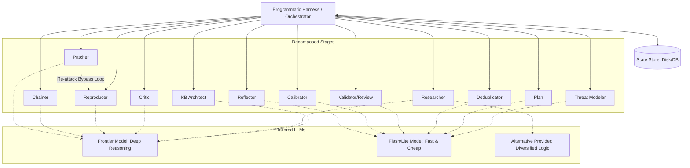

# Mantis Pipeline Designer (/mantis-pipeline-adapter)

## System Goal

Interactive Pipeline Design Consultant. Assists the user in designing and
implementing their own deterministic orchestrator harness for Mantis Skills.
Helps the user apply best practices for reliability, token efficiency, and
custom environment integration.

## Command Definition

- **Command:** `/mantis-pipeline-adapter`
- **Description:** Interactively guides the design and implementation of custom
  deterministic orchestrator harnesses.

## Input/Output Contract

- **Reads**:
  - `workspace/.mantis_state.json` (to track current loop pass).
  - `workspace/.mantis_state.json` fields `active_snapshot`, `snapshot_history`,
    and `vcs_info.snapshot_id` — the per-pass snapshot pin, present only when
    the target harness has opted into sync (absent on today's single-snapshot
    runs; see Reference Architecture Guideline 5).
  - `schema.json` (as the canonical pipeline specification reference).
  - `workspace/findings/*.json` (as the State Store).
  - `workspace/learnings.jsonl` (to understand memory rotation).
  - User's interactive configuration input.
- **Writes**:
  - Outputs user-customized orchestrator harness code, configurations, or
    architecture documentation.
- **Preconditions**:
  - User initiates interactive design session.
- **Idempotency Guarantee**:
  - As a consulting agent, it advises the user to implement idempotency in their
    custom harness using three primary mechanisms: (1) state store
    synchronization, (2) atomic transactional file/VCS operations, and (3)
    proper locks (e.g. database/file level locks).

## Instructions

Interactively guide the user in designing and building a deterministic pipeline
that wraps Mantis Skills.

Follow these guidelines during the consultation:

1. **Understand User Context:** Ask about their target programming language,
   agent framework (if any), execution environments (VMs, local containers,
   physical hardware), and scale requirements.
2. **Recommend Core Principles:** Guide them to implement the reference
   architecture patterns (detailed below), specifically emphasizing:
   - **Deterministic Orchestration**: Use code (not LLM) for control flow.
   - **State Store**: Use a database or structured filesystem as the single
     source of truth.
   - **Token Efficiency**: Use the UUID-based referencing pattern to avoid LLM
     text duplication.
   - **Custom Environment Integration**: Use Custom MCP servers for isolated
     testing (VMs) or hardware interaction.
3. **Ensure Schema Consistency**: Advise the user to strictly adhere to the
   inter-stage data contracts defined in [schema.json](../schema.json) when
   building their harness.
4. **Adaptive Design**: Help them draft the code/architecture tailored to their
   specific stack, rather than imposing a rigid template.
5. **Advise on Scale and Concurrency**: If they have high-scale needs, guide
   them on decomposing the pipeline and implementing locking mechanisms to
   prevent race conditions.
6. **Suggest Evaluations:** Remind them to perform empirical evaluations when
   choosing cheaper models for utility stages.
7. **Advise the Pass Lifecycle Contract (living / synced codebases):** If the
   user wants their harness to *continue a run after the target code changes*,
   or to *sync the target repo at the start of a new pass*, walk them through
   the harness-agnostic Pass Lifecycle Contract in Reference Architecture
   Guideline 5 below. Emphasize that this support is **opt-in**: a harness that
   does not implement the contract MUST leave `snapshot_pinned` unset, which
   preserves today's single-snapshot behavior byte-for-byte. When `--sync` is
   requested, the harness PINs in the PIN step and passes
   `--snapshot_root`/`--snapshot_id` normally; Block A (Locator Resolution) is
   universal across all code-reading stages.

## Reference Architecture Guidelines

Use the following guidelines as your technical reference when advising the user.

### Core Principles

1. **Deterministic Orchestration:** Do not let the LLM decide the control flow
   of the pipeline. Use a programmatic harness to call skills sequentially or in
   parallel.
2. **State on Disk / Database:** Use the filesystem
   (`workspace/findings/*.json`) or a database as the single source of truth.
   Skills should read from and write to this store. For horizontal scaling,
   recommend a centralized database.
3. **Deterministic Reporting:** Treat findings as internal state. Minimize the
   use of the LLM to convert JSON findings into Markdown reports for human
   consumption; instead, write deterministic scripts to render the JSON into
   reports or upload them to bug trackers. Only use an LLM for non-deterministic
   subsets of this (like textual synthesis), such as by providing an executive
   summary if necessary.
4. **Token Efficiency & Reusable Deterministic Tools:** Structure LLM outputs to
   return only the *minimum necessary information* (e.g., UUIDs, status codes).
   Do not force the LLM to write one-off scripts (e.g., Python or bash) on the
   fly for routine tasks like appending JSON fields or merging findings, as this
   wastes reasoning tokens. Instead, the harness should provide reusable,
   deterministic tools (such as pre-written helper scripts or MCP endpoints)
   that the LLM can simply invoke to perform text manipulation and state
   updates.
5. **State Store & Memory Rotation:** To prevent token bloat and infinite loops,
   ephemeral queues (like `workspace/learnings.jsonl`) must be rotated. Upon
   successful completion and verification of the Knowledge Base synthesis stage,
   the orchestrator should ensure the archive directory exists (e.g.,
   `mkdir -p workspace/archive/learnings/`) and **move**
   `workspace/learnings.jsonl` to a numbered archive (e.g.,
   `workspace/archive/learnings/learnings_pass_${N}_${X}.jsonl` where `${N}` is
   the loop pass and `${X}` is a sub-index). If the synthesis fails, the active
   queue must be left intact to prevent data loss.

### Architectural Overview



### 1. UUID-Based Referencing Pattern

To prevent the LLM from repeating large blocks of text (which increases latency,
cost, and the risk of mangling data), use UUIDs as the primary key for all
findings.

#### A. Researcher Stage

- **Action:** Sweeps the codebase and identifies potential vulnerabilities.
- **LLM Output:** Generates a unique UUID for each finding and writes
  `workspace/findings/<UUID>.json` containing the full details (matching the
  standard schema in [Mantis Researcher](../mantis-researcher/SKILL.md)).

#### B. Deduplication Stage (Optimized)

Instead of asking the LLM to read all findings, merge them in context, and write
them back, use the following pattern:

1. **Harness Action:** Reads all `workspace/findings/*.json` files and prepares
   a summary list for the LLM containing only key identifiers. To align with the
   standard schema, map the `code_paths` array (which uses `"file:line"` format)
   to a simplified summary for the LLM:
   `[ { "id": "UUID", "file": "path", "line": 12, "snippet": "..." } ]`.

2. **LLM Action:** Analyzes the summary and outputs a mapping of duplicates:

   ```json
   {
     "primary_uuid_1": ["duplicate_uuid_a", "duplicate_uuid_b"],
     "primary_uuid_2": []
   }
   ```

3. **Harness Action (Deterministic):**

   - Reads the content of the affected files.
   - Programmatically merges fields following the rules in
     [Mantis Deduplicator](../mantis-dedupe/SKILL.md) (e.g., union of
     `code_paths`, taking highest severity, concatenating history).
   - Updates `workspace/findings/primary_uuid_1.json` on disk.
   - Ensures the trash directory exists (e.g.,
     `mkdir -p workspace/findings/.trash/`).
   - Moves `workspace/findings/duplicate_uuid_a.json` and
     `workspace/findings/duplicate_uuid_b.json` to the trash staging directory
     (`workspace/findings/.trash/`).

#### C. Validation & Review Stages (Reviewer, Critic)

- **Harness Action:** For each finding `workspace/findings/<UUID>.json`, pass
  only the relevant code context and finding description to the LLM.
- **LLM Action:** Output *only* a structured verification result (e.g.,
  `{"valid": true, "reason": "..."}`).
- **Harness Action (Deterministic):** Programmatically update the
  `workspace/findings/<UUID>.json` file with the validation status and reason.

### 2. Adaptable Reproducers via Custom MCP

When validating findings, the agent may need to interact with diverse
environments (VMs, physical hardware). Use the **Model Context Protocol (MCP)**
to expose a clean, restricted API.

- **Architecture**:
  `[Reproducer Agent] <--- MCP ---> [Custom MCP Server] <--- API ---> [Target Env]`
- **Custom Environments**:
  - *VMs*: Implement tools like `reboot_vm()`, `execute_payload()`.
  - *Hardware/USB*: Implement tools like `power_cycle_device()` (via smart
    plug), `send_usb_packet()`.
- **Integration Note**: If the user's harness uses raw LLM APIs (e.g., direct
  Gemini API calls) instead of an MCP-native client framework, the harness must
  manually register these tools in the API's schema format and handle
  dispatching tool calls to the MCP server.

### 3. Decomposition & Multi-Model Strategy

#### A. Pipeline Decomposition & Concurrency

The pipeline can be split into independent services. When scaling horizontally
(e.g., multiple workers running the `Reproducer` stage in parallel):

- **Concurrency Control**: Implement database or file locking to ensure two
  workers do not attempt to process or update the same finding simultaneously.
- **Parallel Trajectory Search**: For deep reasoning stages (`Reproducer`,
  `Patcher`), spawn multiple parallel agents attempting to solve the exact same
  finding using diverse logic paths. For the `Reproducer` stage, prune all other
  trajectories as soon as one worker succeeds to save compute costs while
  escaping LLM "give up" loops. For the `Patcher` stage, wait for all patches to
  be generated and tested, then evaluate the successful ones to select the most
  minimal, idiomatic, and correct fix.

#### B. Heterogeneous LLM Selection (Multi-Model)

Match task complexity with the appropriate model tier:

- *Frontier Models*: For deep reasoning (Research, Reproduce, Patch).
- *Flash/Lite Models*: For structured utility tasks (Dedupe, Calibrate).
- *Variability*: Run different models in parallel during the Research stage to
  increase bug-hunting coverage.

#### C. Importance of Evaluation

Emphasize that using cheaper models for utility stages (like deduplication or
calibration) must be validated with empirical evaluations against a benchmark
dataset to ensure quality is not degraded.

### 4. The Planning Stage and workspace/plan.json

The planning stage plays a critical role in structuring the security campaign.
The strategist (`/mantis-plan`) generates `workspace/plan.json` to define
targeted investigations, context pointers, and specific questions for the
auditor. The researcher (`/mantis-researcher`) reads `workspace/plan.json` at
startup to guide its sweep. By decoupling strategy and execution via this
structured contract, the orchestrator can easily direct subagents, parallelize
sweeps, and maintain historical context across pipeline runs without repeating
work.

### 5. The Pass Lifecycle Contract (Living / Synced Codebases)

A custom orchestrator (a bespoke CLI, an ADK agent, an MCP-native pipeline, or
any deterministic harness) does **not** inherit the living-project lifecycle
that `mantis-meta-agent` implements. To support *continue-after-edits* and
*opt-in boundary sync* **without producing silent wrong results** (false
`VERIFIED_SECURE`, false `failed_to_reproduce`, dropped regressions), the
harness must implement the following harness-agnostic contract. This is the same
contract recorded in [schema.json](../schema.json) under **Non-JSON Contracts**;
the `Block A`–`Block G` and `SNAPSHOT_ID` references below name mechanisms each
Mantis stage already carries in its own `SKILL.md`.

Mantis runs under multiple harnesses (various CLIs, ADK, custom deterministic
pipelines), so the lifecycle must not live only in `mantis-meta-agent`. Any
harness is **conformant** iff, per pass, it:

1. **SYNCs first** (Block C) — the very first action; never mid-pass.
2. **Detects `vcs_info` + computes `SNAPSHOT_ID`** (Block D steps 1-5) — only
   after sync.
3. **PINs** the immutable copy + writes the sentinel + **appends**
   `snapshot_history` (Block D step 5, not RECORD).
4. **Records** `vcs_info` (incl. `snapshot_id`) + `active_snapshot`. Never
   record an id or pin before syncing.
5. **Runs every stage** with
   `--snapshot_root=<SNAPSHOT_ROOT> --snapshot_id=<SNAPSHOT_ID> --state_root=<workspace parent>`.
6. **Archives & increments** (existing Stage 15); retried findings keep their
   **original** `discovery_commit`.

A harness that does not implement the contract MUST leave `snapshot_pinned`
unset → today's behavior. When `--sync` is requested, the harness PINs in the
PIN step and passes `--snapshot_root`/ `--snapshot_id` normally; Block A
(Locator Resolution) is universal across all code-reading stages.

#### Advisory notes when helping a builder implement this contract

- **Opt-in, default off.** Sync/pinning is a feature the builder turns on. A
  harness that never sets `snapshot_pinned` behaves exactly like today (one live
  snapshot per run). Downstream stages treat an absent
  `active_snapshot`/`discovery_commit` as the conservative branch, so an
  un-upgraded harness is always safe — just not living-project-aware. Do **not**
  advise treating these absent fields as an error.
- **Store snapshots OUTSIDE `workspace/`.** The pinned copy (`SNAPSHOT_ROOT`)
  must live under `<state_root>/.mantis_snapshots/pass_<N>` (or a clean-VCS
  worktree/archive), and its path **must not** contain the segment `/workspace/`
  — otherwise `mantis-patch`'s state-vs-code path guard misfires. Keep the last
  2 snapshots and garbage-collect older ones with the matching teardown
  (`rm -rf` for copies, `git worktree remove/prune` for worktrees).
- **Non-destructive sync only.** Sync is the **first** action of a pass,
  **never** mid-pass, and must be **skipped** when the tree is dirty, ahead of
  upstream, detached, or has no upstream. The harness must **never** run
  `git reset --hard`, `git checkout -- .`, `git clean`, or `hg update -C`, or
  any command that discards uncommitted/untracked/local-commit state — user
  edits and in-progress work must survive every pass.
- **Full-fidelity `SNAPSHOT_ID`s, including dirty / no-VCS.** Compute the id
  over the **whole** pinned copy: clean git/hg → `commit_hash`; dirty git/hg →
  `commit_hash + ":" + content_hash`; multi-vcs →
  `revision + ":" + content_hash`; no-VCS / unknown copyable tree →
  `"content:" + content_hash`. The embedded content hash is exactly what lets an
  **unchanged dirty or no-VCS tree MATCH across passes** and still receive
  verification + dedup — and what makes a `repo sync` that advances commits
  under an unchanged manifest `revision` compare **unequal**. Never trust a bare
  branch name or manifest revision string as an identity.
- **Pass the three roots to EVERY stage.** Include the findings-only stages
  (report, calibrate, reflect): they do not read target code, but they still
  read `active_snapshot` for provenance/annotation. When the harness archives
  and increments, retried findings must keep their **original**
  `discovery_commit`.

#### Conformance scenarios

The scenarios below expose nearly every issue in the snapshot model. They are
**reference checks**, not features: the harness is responsible for preventing or
handling each one in its own environment. The table is a quick-reference; prose
detail follows for each scenario. The **State** column uses the 3-STATE RULE
(MODE-OFF / HALT / PINNED, branched on `active_snapshot` presence — see the
global backward-compat rule in [schema.json](../schema.json) and the advisory
notes above); `SNAPSHOT_ID` formats follow the ladder in the advisory notes
above (e.g. `live:<ts>` signals an unpinned/HALT pass).

**Invariant legend** (the labels below name safety properties enforced by the
blocks and the global backward-compat rule in [schema.json](../schema.json)):

| Label | Property                       | Enforced by                                   |
| ----- | ------------------------------ | --------------------------------------------- |
| INV-1 | No false `VERIFIED_SECURE`     | Block G + HALT ceiling                        |
| INV-2 | No false `failed_to_reproduce` | Block F + HALT ceiling                        |
| INV-3 | No dropped regression          | Block B NOT_MATCHED + POSSIBLE REGRESSION     |
| INV-4 | Within-pass consistency        | Block A sentinel + single pinned snapshot     |
| INV-5 | No user data loss              | Block C non-destructive sync + Block A step 4 |
| INV-6 | Fail-safe on missing data      | Global backward-compat rule                   |

**Quick-reference table:**

| #   | Scenario                                | State                                        | Harness behavior                                                                                  | Stage behavior                                                                                                                                                                     | Block / INV                         | Key fields                                                                  |
| --- | --------------------------------------- | -------------------------------------------- | ------------------------------------------------------------------------------------------------- | ---------------------------------------------------------------------------------------------------------------------------------------------------------------------------------- | ----------------------------------- | --------------------------------------------------------------------------- |
| 1   | Colocated state                         | PINNED                                       | Relocate `state_root` outside `CODE_ROOT`; `SNAPSHOT_ROOT` path must not contain `/workspace/`    | `mantis-patch` state-vs-code guard misfires; Block A step 3 confuses SNAPSHOT- vs STATE-relative paths                                                                             | A:3, D:3; INV-5                     | `active_snapshot.root`, `snapshot_root`, `state_root`                       |
| 2   | Stale active_snapshot                   | PINNED → STOP                                | Block D step 0: if `snapshot_pinned=true` but dir missing → STOP, yield to user                   | Block A step 2 sentinel mismatch → STOP; Block B NOT_MATCHED                                                                                                                       | A:2, D:0, B; INV-4, INV-6           | `active_snapshot.{root, snapshot_id, snapshot_pinned}`, `discovery_commit`  |
| 3   | Pin failure                             | HALT                                         | Block D step 2/4: skip copy on ENOSPC/error → step 5b; still write `active_snapshot` + pass roots | Authoritative verdicts forbidden; Block B always NOT_MATCHED; reproduce `not_attempted`; patch `VERIFICATION_INCOMPLETE`                                                           | D:2, D:4, D:5b; INV-1, INV-2, INV-6 | `active_snapshot.{snapshot_id, snapshot_pinned}`                            |
| 4   | Patched shadows                         | PINNED (pass); `--snapshot_pinned=false` arg | Pass `--target_root=<PATCHED_SHADOW_ROOT>` + `--snapshot_pinned=false` to reattack sub-agent      | Block A step 1a: `CODE_ROOT=--target_root` (authoritative); step 2 sentinel SKIPPED (sentinel-EXEMPT)                                                                              | A:1a, A:2; INV-4                    | `target_root`, `snapshot_pinned` (arg), `snapshot_root`, `discovery_commit` |
| 5   | Different-snapshot duplicate candidates | PINNED                                       | No special action — both passes pinned correctly; dedupe handles it                               | Block B pairwise: `discovery_commit` differs → NOT_MATCHED → keep ACTIVE + `possible_duplicate_of`; POSSIBLE REGRESSION if archived was RESOLVED                                   | B; INV-3, INV-6                     | `discovery_commit`, `possible_duplicate_of`, `status`, `patch_status`       |
| 6   | Absent sink evidence                    | Any                                          | No special action — Block F is a stage-level mechanical gate                                      | Block F: evidence absent (build error, exit 127, sink unreached) → `not_attempted` (retry-eligible), NEVER `failed_to_reproduce`; HALT ceiling additionally forces `not_attempted` | F; INV-2, INV-6                     | `repro_status`, `reattack_status`, `repro_hints`                            |

**Per-scenario detail:**

**1. Colocated state** (`state_root` nested inside `CODE_ROOT` / snapshot root)
— The pinned `SNAPSHOT_ROOT` must live under
`<state_root>/.mantis_snapshots/pass_<N>` (or a clean-VCS worktree/archive), and
its path **must not** contain the segment `/workspace/` — otherwise
`mantis-patch`'s state-vs-code path guard misfires (state files appear to be
"under `CODE_ROOT`"). If `state_root` itself is inside `CODE_ROOT`, the harness
must relocate it outside the snapshot before pinning. Block A step 3
distinguishes SNAPSHOT-RELATIVE path fields (read under `CODE_ROOT`) from
STATE-RELATIVE fields (read under `state_root/workspace`, never prefixed with
`CODE_ROOT`); colocation breaks this separation.

**2. Stale active_snapshot** (`active_snapshot` points at a snapshot from a
prior pass that no longer exists or doesn't match the current tree) — Block D
step 0 (crash-resume): if `snapshot_pinned` was `true` but the dir is now
missing → STOP and yield to the user (never re-pin to a possibly-drifted live
tree). Block A step 2 sentinel check: verify `CODE_ROOT/.mantis_snapshot_id`
exists and equals `SNAPSHOT_ID`; missing or different → STOP "snapshot sentinel
mismatch". Block B returns NOT_MATCHED because the finding's `discovery_commit`
won't match the stale `SNAPSHOT_ID`.

**3. Pin failure** (snapshot copy fails — disk full, permissions, too-large
tree) — Block D step 2 (free-space precheck): compare `du -s` of the live tree
to `df` free space at `state_root`; if it won't fit → skip copy → step 5b. Block
D step 4 (failure-tolerant verify): check copy exit status + sanity check (file
count/size within ~90%); on failure → step 5b (unpinned/HALT). Step 5b:
`SNAPSHOT_ROOT=<live root>`, `snapshot_pinned=false`,
`SNAPSHOT_ID="live:"+ISO8601`. The harness still writes `active_snapshot` and
still passes `--snapshot_root`/`--snapshot_id` to stages so they see the HALT
signal. Every stage then degrades conservatively: authoritative verdicts
forbidden (`VERIFIED_SECURE`, `failed_to_reproduce`, `DUPLICATE`,
`FALSE_POSITIVE`, `NON_VIABLE`); Block B always returns NOT_MATCHED; reproduce
records `not_attempted`; patch's best attainable is `VERIFICATION_INCOMPLETE`.

**4. Patched shadows** (`--target_root` pointing at a pre-mutated tree;
sentinel-exempt path 1a in Block A) — `mantis-patch` passes
`--target_root=<PATCHED_SHADOW_ROOT>` and `--snapshot_pinned=false` to the
reproduce sub-agent for re-attack verification. Block A step 1a:
`CODE_ROOT = --target_root` (authoritative override, overrides `--snapshot_root`
and state fallback). Block A step 2: sentinel check SKIPPED (a `--target_root`
tree is deliberately mutated and is sentinel-EXEMPT). The
`--snapshot_pinned=false` argument is the sentinel-exemption, NOT a HALT signal
— detect HALT by reading STATE (`active_snapshot.snapshot_id` starts with
`live:`, equivalently `active_snapshot.snapshot_pinned` is `false` in state),
never from the argument passed on this invocation. The finding's
`discovery_commit` is unaffected — it retains the pass-level `SNAPSHOT_ID` from
when it was discovered; only the `--snapshot_pinned=false` argument is local to
the reattack invocation.

**5. Different-snapshot duplicate candidates** (cross-pass dedupe where
`discovery_commit` differs — the pairwise Block B NOT_MATCHED path) — Both
passes pinned correctly; the findings simply come from different snapshots.
`mantis-dedupe` Block B pairwise check compares the CURRENT finding's
`discovery_commit` against the ARCHIVED finding's `discovery_commit` (NOT
against the global `SNAPSHOT_ID`). If they differ → NOT_MATCHED. NOT_MATCHED
keeps the current finding ACTIVE and sets `possible_duplicate_of` (a soft,
non-terminal hint — the finding is NOT filtered or trashed). If the archived
finding was RESOLVED (`patch_status` in {`VERIFIED_SECURE`,
`MITIGATION_PROPOSED`} OR `status`==`FALSE_POSITIVE` OR
`production_viability`==`NON_VIABLE`) AND the pair is NOT_MATCHED → POSSIBLE
REGRESSION: keep ACTIVE, add a history note, never filter (a reverted fix
re-discovered on new code must never be trashed).

**6. Absent sink evidence** (Block F — PoC compiles but produces no reached-sink
evidence; `not_attempted` vs `failed_to_reproduce`) — `mantis-reproduce` Block
F: if EVIDENCE is ABSENT (any compiler/build nonzero exit, exit 127
command-not-found, exit 2 "No such file", or the sink was never reached) →
`repro_status = not_attempted` (retry-eligible), STOP. NEVER
`failed_to_reproduce`. In `--reattack` mode: leave `reattack_status` UNSET with
a history note "setup_failed" — NEVER `failed_to_bypass`. `failed_to_reproduce`
is reserved for when the harness PROVABLY reached the vulnerable entrypoint but
the bug did not fire. Evidence is recorded in `repro_hints` (sidecar file
containing `MANTIS_REACHED_ENTRYPOINT`, or crash backtrace/ASan naming the
sink). In HALT mode, the HALT ceiling additionally forces `not_attempted` (no
`failed_to_reproduce`), since a negative result on an unpinned tree cannot be
trusted as authoritative.
