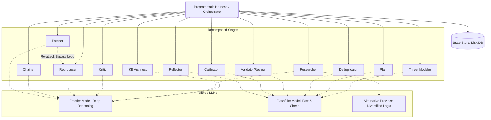

# Mantis Pipeline Designer (/mantis-pipeline-adapter)

## System Goal

Interactive Pipeline Design Consultant. Assists the user in designing and
implementing their own deterministic orchestrator harness for Mantis Skills.
Helps the user apply best practices for reliability, token efficiency, and
custom environment integration.

## Command Definition

- **Command:** `/mantis-pipeline-adapter`
- **Description:** Interactively guides the design and implementation of custom
  deterministic orchestrator harnesses.

## Input/Output Contract

- **Reads**:
  - `workspace/.mantis_state.json` (to track current loop pass).
  - `workspace/.mantis_state.json` fields `active_snapshot`, `snapshot_history`,
    and `vcs_info.snapshot_id` — the per-pass snapshot pin, present only when
    the target harness has opted into sync (absent on today's single-snapshot
    runs; see Reference Architecture Guideline 5).
  - `schema.json` (as the canonical pipeline specification reference).
  - `workspace/findings/*.json` (as the State Store).
  - `workspace/learnings.jsonl` (to understand memory rotation).
  - User's interactive configuration input.
- **Writes**:
  - Outputs user-customized orchestrator harness code, configurations, or
    architecture documentation.
- **Preconditions**:
  - User initiates interactive design session.
- **Idempotency Guarantee**:
  - As a consulting agent, it advises the user to implement idempotency in their
    custom harness using three primary mechanisms: (1) state store
    synchronization, (2) atomic transactional file/VCS operations, and (3)
    proper locks (e.g. database/file level locks).

## Instructions

Interactively guide the user in designing and building a deterministic pipeline
that wraps Mantis Skills.

Follow these guidelines during the consultation:

01. **Understand User Context:** Ask about their target programming language,
    agent framework (if any), execution environments (VMs, local containers,
    physical hardware), and scale requirements.
02. **Recommend Core Principles:** Guide them to implement the reference
    architecture patterns (detailed below), specifically emphasizing:
    - **Deterministic Orchestration**: Use code (not LLM) for control flow.
    - **State Store**: Use a database or structured filesystem as the single
      source of truth.
    - **Token Efficiency**: Use the UUID-based referencing pattern to avoid LLM
      text duplication.
    - **Custom Environment Integration**: Use Custom MCP servers for isolated
      testing (VMs) or hardware interaction.
03. **Ensure Schema Consistency**: Advise the user to strictly adhere to the
    inter-stage data contracts defined in [schema.json](../schema.json) when
    building their harness.
04. **Adaptive Design**: Help them draft the code/architecture tailored to their
    specific stack, rather than imposing a rigid template.
05. **Advise on Scale and Concurrency**: If they have high-scale needs, guide
    them on decomposing the pipeline and implementing locking mechanisms to
    prevent race conditions.
06. **Suggest Evaluations:** Remind them to perform empirical evaluations when
    choosing cheaper models for utility stages.
07. **Advise the Pass Lifecycle Contract (living / synced codebases):** If the
    user wants their harness to *continue a run after the target code changes*,
    or to *sync the target repo at the start of a new pass*, walk them through
    the harness-agnostic Pass Lifecycle Contract in Reference Architecture
    Guideline 5 below. Emphasize that this support is **opt-in**: a harness that
    does not implement the contract MUST leave `snapshot_pinned` unset, which
    preserves today's single-snapshot behavior byte-for-byte. When `--sync` is
    requested, the harness PINs in the PIN step and passes
    `--snapshot_root`/`--snapshot_id` normally; Block A (Locator Resolution) is
    universal across all code-reading stages.
08. **Advise on Semantic Retrieval at Scale:** If the user is targeting a large
    codebase (e.g., thousands of source files, multi-pass campaigns, or multiple
    teams contributing findings), walk them through the optional semantic
    retrieval patterns in Reference Architecture Guidelines 6 and 7 below.
    Emphasize that these are **opt-in**: they augment the pipeline via a
    dedicated query skill or MCP tools, but never modify the existing skills'
    own deterministic logic or fail-safe invariants.
09. **Advise on SAST Seeding:** If the user wants to augment LLM-based discovery
    with external SAST tool findings (CodeQL, Semgrep, etc.), walk them through
    the optional SAST seeding pattern in Reference Architecture Guideline 8
    below. Emphasize that this is **opt-in**: it ingests external findings as
    candidates that must earn their verdict through unchanged downstream gates,
    and it follows exactly the RAG pattern (provenance-tracked, snapshot-aware,
    fallback on failure).
10. **Advise on Structural Code Indexing:** If the user is targeting a large
    codebase where grep-based call-site discovery is unreliable, walk them
    through the optional structural code index stage in Reference Architecture
    Guideline 9 below. Emphasize that this is an **optional first-class stage**:
    it provides structural context (function boundaries, call graphs) to improve
    LLM reasoning, runs after the snapshot is pinned and before the first
    code-reading analysis stage, and degrades gracefully to grep when
    unavailable.

## Reference Architecture Guidelines

Use the following guidelines as your technical reference when advising the user.

### Core Principles

1. **Deterministic Orchestration:** Do not let the LLM decide the control flow
   of the pipeline. Use a programmatic harness to call skills sequentially or in
   parallel.
2. **State on Disk / Database:** Use the filesystem
   (`workspace/findings/*.json`) or a database as the single source of truth.
   Skills should read from and write to this store. For horizontal scaling,
   recommend a centralized database.
3. **Deterministic Reporting:** Treat findings as internal state. Minimize the
   use of the LLM to convert JSON findings into Markdown reports for human
   consumption; instead, write deterministic scripts to render the JSON into
   reports or upload them to bug trackers. Only use an LLM for non-deterministic
   subsets of this (like textual synthesis), such as by providing an executive
   summary if necessary.
4. **Token Efficiency & Reusable Deterministic Tools:** Structure LLM outputs to
   return only the *minimum necessary information* (e.g., UUIDs, status codes).
   Do not force the LLM to write one-off scripts (e.g., Python or bash) on the
   fly for routine tasks like appending JSON fields or merging findings, as this
   wastes reasoning tokens. Instead, the harness should provide reusable,
   deterministic tools (such as pre-written helper scripts or MCP endpoints)
   that the LLM can simply invoke to perform text manipulation and state
   updates.
5. **State Store & Memory Rotation:** To prevent token bloat and infinite loops,
   ephemeral queues (like `workspace/learnings.jsonl`) must be rotated. Upon
   successful completion and verification of the Knowledge Base synthesis stage,
   the orchestrator should ensure the archive directory exists (e.g.,
   `mkdir -p workspace/archive/learnings/`) and **move**
   `workspace/learnings.jsonl` to a numbered archive (e.g.,
   `workspace/archive/learnings/learnings_pass_${N}_${X}.jsonl` where `${N}` is
   the loop pass and `${X}` is a sub-index). If the synthesis fails, the active
   queue must be left intact to prevent data loss.

### Architectural Overview



### 1. UUID-Based Referencing Pattern

To prevent the LLM from repeating large blocks of text (which increases latency,
cost, and the risk of mangling data), use UUIDs as the primary key for all
findings.

#### A. Researcher Stage

- **Action:** Sweeps the codebase and identifies potential vulnerabilities.
- **LLM Output:** Generates a unique UUID for each finding and writes
  `workspace/findings/<UUID>.json` containing the full details (matching the
  standard schema in [Mantis Researcher](../mantis-researcher/SKILL.md)).

#### B. Deduplication Stage (Optimized)

Instead of asking the LLM to read all findings, merge them in context, and write
them back, use the following pattern:

1. **Harness Action:** Reads all `workspace/findings/*.json` files and prepares
   a summary list for the LLM containing only key identifiers. To align with the
   standard schema, map the `code_paths` array (which uses `"file:line"` format)
   to a simplified summary for the LLM:
   `[ { "id": "UUID", "file": "path", "line": 12, "snippet": "..." } ]`.

2. **LLM Action:** Analyzes the summary and outputs a mapping of duplicates:

   ```json
   {
     "primary_uuid_1": ["duplicate_uuid_a", "duplicate_uuid_b"],
     "primary_uuid_2": []
   }
   ```

3. **Harness Action (Deterministic):**

   - Reads the content of the affected files.
   - Programmatically merges fields following the rules in
     [Mantis Deduplicator](../mantis-dedupe/SKILL.md) (e.g., union of
     `code_paths`, taking highest severity, concatenating history).
   - Updates `workspace/findings/primary_uuid_1.json` on disk.
   - Ensures the trash directory exists (e.g.,
     `mkdir -p workspace/findings/.trash/`).
   - Moves `workspace/findings/duplicate_uuid_a.json` and
     `workspace/findings/duplicate_uuid_b.json` to the trash staging directory
     (`workspace/findings/.trash/`).

#### C. Validation & Review Stages (Reviewer, Critic)

- **Harness Action:** For each finding `workspace/findings/<UUID>.json`, pass
  only the relevant code context and finding description to the LLM.
- **LLM Action:** Output *only* a structured verification result (e.g.,
  `{"valid": true, "reason": "..."}`).
- **Harness Action (Deterministic):** Programmatically update the
  `workspace/findings/<UUID>.json` file with the validation status and reason.

### 2. Adaptable Reproducers via Custom MCP

When validating findings, the agent may need to interact with diverse
environments (VMs, physical hardware). Use the **Model Context Protocol (MCP)**
to expose a clean, restricted API.

- **Architecture**:
  `[Reproducer Agent] <--- MCP ---> [Custom MCP Server] <--- API ---> [Target Env]`
- **Custom Environments**:
  - *VMs*: Implement tools like `reboot_vm()`, `execute_payload()`.
  - *Hardware/USB*: Implement tools like `power_cycle_device()` (via smart
    plug), `send_usb_packet()`.
- **Integration Note**: If the user's harness uses raw LLM APIs (e.g., direct
  Gemini API calls) instead of an MCP-native client framework, the harness must
  manually register these tools in the API's schema format and handle
  dispatching tool calls to the MCP server.

### 3. Decomposition & Multi-Model Strategy

#### A. Pipeline Decomposition & Concurrency

The pipeline can be split into independent services. When scaling horizontally
(e.g., multiple workers running the `Reproducer` stage in parallel):

- **Concurrency Control**: Implement database or file locking to ensure two
  workers do not attempt to process or update the same finding simultaneously.
- **Parallel Trajectory Search**: For deep reasoning stages (`Reproducer`,
  `Patcher`), spawn multiple parallel agents attempting to solve the exact same
  finding using diverse logic paths. For the `Reproducer` stage, prune all other
  trajectories as soon as one worker succeeds to save compute costs while
  escaping LLM "give up" loops. For the `Patcher` stage, wait for all patches to
  be generated and tested, then evaluate the successful ones to select the most
  minimal, idiomatic, and correct fix.

#### B. Heterogeneous LLM Selection (Multi-Model)

Match task complexity with the appropriate model tier:

- *Frontier Models*: For deep reasoning (Research, Reproduce, Patch).
- *Flash/Lite Models*: For structured utility tasks (Dedupe, Calibrate).
- *Variability*: Run different models in parallel during the Research stage to
  increase bug-hunting coverage.

#### C. Importance of Evaluation

Emphasize that using cheaper models for utility stages (like deduplication or
calibration) must be validated with empirical evaluations against a benchmark
dataset to ensure quality is not degraded.

### 4. The Planning Stage and workspace/plan.json

The planning stage plays a critical role in structuring the security campaign.
The strategist (`/mantis-plan`) generates `workspace/plan.json` to define
targeted investigations, context pointers, and specific questions for the
auditor. The researcher (`/mantis-researcher`) reads `workspace/plan.json` at
startup to guide its sweep. By decoupling strategy and execution via this
structured contract, the orchestrator can easily direct subagents, parallelize
sweeps, and maintain historical context across pipeline runs without repeating
work.

### 5. The Pass Lifecycle Contract (Living / Synced Codebases)

A custom orchestrator (a bespoke CLI, an ADK agent, an MCP-native pipeline, or
any deterministic harness) does **not** inherit the living-project lifecycle
that `mantis-meta-agent` implements. To support *continue-after-edits* and
*opt-in boundary sync* **without producing silent wrong results** (false
`VERIFIED_SECURE`, false `failed_to_reproduce`, dropped regressions), the
harness must implement the following harness-agnostic contract. This is the same
contract recorded in [schema.json](../schema.json) under **Non-JSON Contracts**;
the `Block A`–`Block G` and `SNAPSHOT_ID` references below name mechanisms each
Mantis stage already carries in its own `SKILL.md`.

Mantis runs under multiple harnesses (various CLIs, ADK, custom deterministic
pipelines), so the lifecycle must not live only in `mantis-meta-agent`. Any
harness is **conformant** iff, per pass, it:

1. **SYNCs first** (Block C) — the very first action; never mid-pass.
2. **Detects `vcs_info` + computes `SNAPSHOT_ID`** (Block D steps 1-5) — only
   after sync.
3. **PINs** the immutable copy + writes the sentinel + **appends**
   `snapshot_history` (Block D step 5, not RECORD).
4. **Records** `vcs_info` (incl. `snapshot_id`) + `active_snapshot`. Never
   record an id or pin before syncing.
5. **Runs every stage** with
   `--snapshot_root=<SNAPSHOT_ROOT> --snapshot_id=<SNAPSHOT_ID> --state_root=<workspace parent>`.
6. **Archives & increments** (existing Stage 15); retried findings keep their
   **original** `discovery_commit`.

A harness that does not implement the contract MUST leave `snapshot_pinned`
unset → today's behavior. When `--sync` is requested, the harness PINs in the
PIN step and passes `--snapshot_root`/ `--snapshot_id` normally; Block A
(Locator Resolution) is universal across all code-reading stages.

#### Advisory notes when helping a builder implement this contract

- **Opt-in, default off.** Sync/pinning is a feature the builder turns on. A
  harness that never sets `snapshot_pinned` behaves exactly like today (one live
  snapshot per run). Downstream stages treat an absent
  `active_snapshot`/`discovery_commit` as the conservative branch, so an
  un-upgraded harness is always safe — just not living-project-aware. Do **not**
  advise treating these absent fields as an error.
- **Store snapshots OUTSIDE `workspace/`.** The pinned copy (`SNAPSHOT_ROOT`)
  must live under `<state_root>/.mantis_snapshots/pass_<N>` (or a clean-VCS
  worktree/archive), and its path **must not** contain the segment `/workspace/`
  — otherwise `mantis-patch`'s state-vs-code path guard misfires. Keep the last
  2 snapshots and garbage-collect older ones with the matching teardown
  (`rm -rf` for copies, `git worktree remove/prune` for worktrees).
- **Non-destructive sync only.** Sync is the **first** action of a pass,
  **never** mid-pass, and must be **skipped** when the tree is dirty, ahead of
  upstream, detached, or has no upstream. The harness must **never** run
  `git reset --hard`, `git checkout -- .`, `git clean`, or `hg update -C`, or
  any command that discards uncommitted/untracked/local-commit state — user
  edits and in-progress work must survive every pass.
- **Full-fidelity `SNAPSHOT_ID`s, including dirty / no-VCS.** Compute the id
  over the **whole** pinned copy: clean git/hg → `commit_hash`; dirty git/hg →
  `commit_hash + ":" + content_hash`; multi-vcs →
  `revision + ":" + content_hash`; no-VCS / unknown copyable tree →
  `"content:" + content_hash`. The embedded content hash is exactly what lets an
  **unchanged dirty or no-VCS tree MATCH across passes** and still receive
  verification + dedup — and what makes a `repo sync` that advances commits
  under an unchanged manifest `revision` compare **unequal**. Never trust a bare
  branch name or manifest revision string as an identity.
- **Pass the three roots to EVERY stage.** Include the findings-only stages
  (report, calibrate, reflect): they do not read target code, but they still
  read `active_snapshot` for provenance/annotation. When the harness archives
  and increments, retried findings must keep their **original**
  `discovery_commit`.

#### Conformance scenarios

The scenarios below expose nearly every issue in the snapshot model. They are
**reference checks**, not features: the harness is responsible for preventing or
handling each one in its own environment. The table is a quick-reference; prose
detail follows for each scenario. The **State** column uses the 3-STATE RULE
(MODE-OFF / HALT / PINNED, branched on `active_snapshot` presence — see the
global backward-compat rule in [schema.json](../schema.json) and the advisory
notes above); `SNAPSHOT_ID` formats follow the ladder in the advisory notes
above (e.g. `live:<ts>` signals an unpinned/HALT pass).

**Invariant legend** (the labels below name safety properties enforced by the
blocks and the global backward-compat rule in [schema.json](../schema.json)):

| Label | Property                       | Enforced by                                   |
| ----- | ------------------------------ | --------------------------------------------- |
| INV-1 | No false `VERIFIED_SECURE`     | Block G + HALT ceiling                        |
| INV-2 | No false `failed_to_reproduce` | Block F + HALT ceiling                        |
| INV-3 | No dropped regression          | Block B NOT_MATCHED + POSSIBLE REGRESSION     |
| INV-4 | Within-pass consistency        | Block A sentinel + single pinned snapshot     |
| INV-5 | No user data loss              | Block C non-destructive sync + Block A step 4 |
| INV-6 | Fail-safe on missing data      | Global backward-compat rule                   |

**Quick-reference table:**

| #   | Scenario                                                            | State                                        | Harness behavior                                                                                                                                                                           | Stage behavior                                                                                                                                                                                                      | Block / INV                             | Key fields                                                                                            |
| --- | ------------------------------------------------------------------- | -------------------------------------------- | ------------------------------------------------------------------------------------------------------------------------------------------------------------------------------------------ | ------------------------------------------------------------------------------------------------------------------------------------------------------------------------------------------------------------------- | --------------------------------------- | ----------------------------------------------------------------------------------------------------- |
| 1   | Colocated state                                                     | PINNED                                       | HALT-and-yield (safe default), or relocate `state_root` outside `CODE_ROOT` when explicitly authorized (e.g. `--auto_relocate_state`); `SNAPSHOT_ROOT` path must not contain `/workspace/` | `mantis-patch` state-vs-code guard misfires; Block A step 3 confuses SNAPSHOT- vs STATE-relative paths                                                                                                              | A:3, D:3; INV-5                         | `active_snapshot.root`, `snapshot_root`, `state_root`                                                 |
| 2   | Stale active_snapshot (`active_snapshot.pass != state.pass_number`) | PINNED → STOP or HALT-degrade                | Block D step 0: handles same-pass re-entry only; if dir missing → STOP, yield to user                                                                                                      | Block A step 2 sentinel may still MATCH (dir retained); CURRENT-PASS CHECK (`active_snapshot.pass == state.pass_number`) required: mismatch → STOP or HALT-degrade (Block B NOT_MATCHED, no authoritative verdicts) | A:2, D:0, B; INV-1, INV-3, INV-4, INV-6 | `active_snapshot.{root, snapshot_id, snapshot_pinned, pass}`, `state.pass_number`, `discovery_commit` |
| 3   | Pin failure                                                         | HALT                                         | Block D step 2/4: skip copy on ENOSPC/error → step 5b; still write `active_snapshot` + pass roots                                                                                          | Authoritative verdicts forbidden; Block B always NOT_MATCHED; reproduce `not_attempted`; patch `VERIFICATION_INCOMPLETE`                                                                                            | D:2, D:4, D:5b; INV-1, INV-2, INV-6     | `active_snapshot.{snapshot_id, snapshot_pinned}`                                                      |
| 4   | Patched shadows                                                     | PINNED (pass); `--snapshot_pinned=false` arg | Pass `--target_root=<PATCHED_SHADOW_ROOT>` + `--snapshot_pinned=false` to reattack sub-agent                                                                                               | Block A step 1a: `CODE_ROOT=--target_root` (authoritative); step 2 sentinel SKIPPED (sentinel-EXEMPT)                                                                                                               | A:1a, A:2; INV-4                        | `target_root`, `snapshot_pinned` (arg), `snapshot_root`, `discovery_commit`                           |
| 5   | Different-snapshot duplicate candidates                             | PINNED                                       | No special action — both passes pinned correctly; dedupe handles it                                                                                                                        | Block B pairwise: `discovery_commit` differs → NOT_MATCHED → keep ACTIVE + `possible_duplicate_of`; POSSIBLE REGRESSION if archived was RESOLVED                                                                    | B; INV-3, INV-6                         | `discovery_commit`, `possible_duplicate_of`, `status`, `patch_status`                                 |
| 6   | Absent sink evidence                                                | Any                                          | No special action — Block F is a stage-level mechanical gate                                                                                                                               | Block F: evidence absent (build error, exit 127, sink unreached) → `not_attempted` (retry-eligible), NEVER `failed_to_reproduce`; HALT ceiling additionally forces `not_attempted`                                  | F; INV-2, INV-6                         | `repro_status`, `reattack_status`, `repro_hints`                                                      |

**Per-scenario detail:**

**1. Colocated state** (`state_root` nested inside `CODE_ROOT` / snapshot root)
— The pinned `SNAPSHOT_ROOT` must live under
`<state_root>/.mantis_snapshots/pass_<N>` (or a clean-VCS worktree/archive), and
its path **must not** contain the segment `/workspace/` — otherwise
`mantis-patch`'s state-vs-code path guard misfires (state files appear to be
"under `CODE_ROOT`"). If `state_root` itself is inside `CODE_ROOT`, the harness
must HALT-and-yield (safe default) or, when explicitly authorized (e.g.
`--auto_relocate_state`), relocate it outside the snapshot before pinning. Block
A step 3 distinguishes SNAPSHOT-RELATIVE path fields (read under `CODE_ROOT`)
from STATE-RELATIVE fields (read under `state_root/workspace`, never prefixed
with `CODE_ROOT`); colocation breaks this separation.

**2. Stale active_snapshot** (`active_snapshot.pass != state.pass_number` —
`active_snapshot` was preserved across the Stage 15 pass increment) — Block D
step 0 (crash-resume) handles only the SAME-pass re-entry case
(`active_snapshot.pass == N` → reuse). It does NOT catch a stale snapshot
carried across the Stage 15 pass increment, because Stage 15 deliberately
preserves `active_snapshot` while bumping `pass_number` (see Stage 15). Two
sub-cases:

(a) The prior snapshot dir is now MISSING: Block D step 0 STOPs and yields to
the user (never re-pin to a possibly-drifted live tree). (b) The prior snapshot
dir still EXISTS (default keep-2 retention) and its sentinel matches the
preserved `active_snapshot.snapshot_id`: Block A step 2 sentinel check SUCCEEDS
(it only compares the sentinel file to `SNAPSHOT_ID`, not to the current pass).
Block B's pairwise `discovery_commit` check would MATCH a carried-forward
finding against a new finding stamped with the same stale `SNAPSHOT_ID`,
silently dropping it as `DUPLICATE` — a false authoritative verdict.

To prevent (b), the HARNESS MUST guarantee that
`active_snapshot.pass == state.pass_number` before any consumer stage reads it.
The reference harness (`mantis-meta-agent`) satisfies this by re-pinning every
pass (Block D step 0 sees `active_snapshot.pass != N` → re-pins → refreshes
`active_snapshot.pass` before any stage runs), so sub-case (b) never fires
there. A custom harness that preserves `active_snapshot` across the Stage 15
pass increment WITHOUT re-pinning MUST either (a) re-pin every pass (the
reference behavior), or (b) inject an equivalent pre-stage gate that refreshes
`active_snapshot.pass` or clears `active_snapshot` entirely before invoking
stages. Stages CANNOT self-detect this staleness via Block B (which is
`snapshot_id`-only, not `pass`-aware): a carried-forward finding and a new
finding stamped with the same stale `SNAPSHOT_ID` will MATCH in Block B despite
the snapshot being stale. The `active_snapshot.pass` field is defined in
`schema.json` `#/$defs/state/active_snapshot/pass` for exactly this check. The
harness's Block D step 0 reuse check is NOT a substitute: it only fires on
same-pass re-entry. (Stages that read `active_snapshot` MAY additionally
self-check defensively — see each stage's Step 0 sentinel check — but the
binding guarantee is on the harness.)

**3. Pin failure** (snapshot copy fails — disk full, permissions, too-large
tree) — Block D step 2 (free-space precheck): compare `du -s` of the live tree
to `df` free space at `state_root`; if it won't fit → skip copy → step 5b. Block
D step 4 (failure-tolerant verify): check copy exit status + sanity check (file
count/size within ~90%); on failure → step 5b (unpinned/HALT). Step 5b:
`SNAPSHOT_ROOT=<live root>`, `snapshot_pinned=false`,
`SNAPSHOT_ID="live:"+ISO8601`. The harness still writes `active_snapshot` and
still passes `--snapshot_root`/`--snapshot_id` to stages so they see the HALT
signal. Every stage then degrades conservatively: authoritative verdicts
forbidden (`VERIFIED_SECURE`, `failed_to_reproduce`, `DUPLICATE`,
`FALSE_POSITIVE`, `NON_VIABLE`); Block B always returns NOT_MATCHED; reproduce
records `not_attempted`; patch's best attainable is `VERIFICATION_INCOMPLETE`.

**4. Patched shadows** (`--target_root` pointing at a pre-mutated tree;
sentinel-exempt path 1a in Block A) — `mantis-patch` passes
`--target_root=<PATCHED_SHADOW_ROOT>` and `--snapshot_pinned=false` to the
reproduce sub-agent for re-attack verification. Block A step 1a:
`CODE_ROOT = --target_root` (authoritative override, overrides `--snapshot_root`
and state fallback). Block A step 2: sentinel check SKIPPED (a `--target_root`
tree is deliberately mutated and is sentinel-EXEMPT). The
`--snapshot_pinned=false` argument is the sentinel-exemption, NOT a HALT signal
— detect HALT by reading STATE (`active_snapshot.snapshot_id` starts with
`live:`, equivalently `active_snapshot.snapshot_pinned` is `false` in state),
never from the argument passed on this invocation. The finding's
`discovery_commit` is unaffected — it retains the pass-level `SNAPSHOT_ID` from
when it was discovered; only the `--snapshot_pinned=false` argument is local to
the reattack invocation.

**5. Different-snapshot duplicate candidates** (cross-pass dedupe where
`discovery_commit` differs — the pairwise Block B NOT_MATCHED path) — Both
passes pinned correctly; the findings simply come from different snapshots.
`mantis-dedupe` Block B pairwise check compares the CURRENT finding's
`discovery_commit` against the ARCHIVED finding's `discovery_commit` (NOT
against the global `SNAPSHOT_ID`). If they differ → NOT_MATCHED. NOT_MATCHED
keeps the current finding ACTIVE and sets `possible_duplicate_of` (a soft,
non-terminal hint — the finding is NOT filtered or trashed). If the archived
finding was RESOLVED (`patch_status` in {`VERIFIED_SECURE`,
`MITIGATION_PROPOSED`} OR `status`==`FALSE_POSITIVE` OR
`production_viability`==`NON_VIABLE`) AND the pair is NOT_MATCHED → POSSIBLE
REGRESSION: keep ACTIVE, add a history note, never filter (a reverted fix
re-discovered on new code must never be trashed).

**6. Absent sink evidence** (Block F — PoC compiles but produces no reached-sink
evidence; `not_attempted` vs `failed_to_reproduce`) — `mantis-reproduce` Block
F: if EVIDENCE is ABSENT (any compiler/build nonzero exit, exit 127
command-not-found, exit 2 "No such file", or the sink was never reached) →
`repro_status = not_attempted` (retry-eligible), STOP. NEVER
`failed_to_reproduce`. In `--reattack` mode: leave `reattack_status` UNSET with
a history note "setup_failed" — NEVER `failed_to_bypass`. `failed_to_reproduce`
is reserved for when the harness PROVABLY reached the vulnerable entrypoint —
i.e. reached-sink evidence, not setup evidence — but the bug did not fire.
Reached-sink evidence must originate INSIDE the invoked path or from
target-produced tracing/backtraces: (a) a PoC script/source harness writes
`MANTIS_REACHED_ENTRYPOINT` to a sidecar file at the point just before the sink
call, within its own execution flow (the marker write is part of the invoked
path, not a pre-launch step); OR (b) for binary/firmware/raw-payload targets,
the captured crash backtrace or sanitizer trace (ASan/UBSan/MSan/TSan)
explicitly names the target sink function (target-produced tracing). A marker
written by an external wrapper BEFORE invoking the target is SETUP EVIDENCE ONLY
(proves "launch attempted," not "sink reached") and does NOT by itself justify
`failed_to_reproduce` — treat it as EVIDENCE ABSENT for the decision gate.
Evidence is recorded in `repro_hints`. In HALT mode, the HALT ceiling
additionally forces `not_attempted` (no `failed_to_reproduce`), since a negative
result on an unpinned tree cannot be trusted as authoritative.

______________________________________________________________________

### 6. Semantic Retrieval (RAG) for Large Codebases

For small repositories, the planner can manually scan `workspace/kb/index.md`
and the researcher can grep for call-sites. At scale (thousands of files, deep
directory trees, multi-pass campaigns), these approaches miss relevant context
and waste tokens reading irrelevant files. A semantic retrieval layer lets the
planner and researcher query for relevant KB entries and code locations without
reading everything.

Two implementations are supported, sharing the same data contract:

- **Option A (Default — Skill-Based):** A dedicated skill that runs a
  BM25/TF-IDF helper script over `chunks.jsonl`. Zero external dependencies —
  works air-gapped, no vector embeddings or vector store required. Optional
  vector embedding support if available.
- **Option B (Maximum Scale — MCP-Based):** The harness owns a persistent vector
  index using vector embeddings, serving persistent `semantic_search_kb` /
  `semantic_search_code` MCP tools. Better for very large codebases where
  per-invocation BM25 is too slow.

Both are **opt-in**. The existing skills are not modified; the planner and
researcher receive runtime instructions to use whichever retrieval mechanism is
available, falling back to today's manual behavior if neither is present.
Retrieval results are **coverage HINTs only** — they decide ordering and
prioritization, never the membership of the audit set. A miss must never cause a
file, call-site, or investigation to be skipped or dropped.

#### A. Shared Data Contract: `chunks.jsonl`

After Stage 2 (`/mantis-architecture`) completes, chunks are extracted into
`workspace/kb/chunks.jsonl` (one JSON object per line). The harness can do this
post-hoc by reading `workspace/kb/*.md`, or the architecture skill can be
instructed to write it during synthesis as a text-only side effect. Two chunk
types are produced:

1. **KB chunks** from the existing `workspace/kb/*.md` files:

   ```json
   {"id": "auth_module:0", "source_file": "workspace/kb/entities/auth_module.md", "entity_type": "entity", "chunk_text": "The auth module handles..."}
   ```

2. **Code chunks** from `CODE_ROOT` (the pinned snapshot). Each chunk includes
   the file path and line range so the researcher can request specific files
   from the snapshot:

   ```json
   {"id": "src/parser.c:0", "source_file": "src/parser.c", "start_line": 1, "end_line": 80, "chunk_text": "int parse_input(..."}
   ```

The first line of `chunks.jsonl` is a provenance header recording the
`SNAPSHOT_ID` the chunks were built against:

```json
{"_provenance": true, "snapshot_id": "abc123", "kb_snapshot_id": "abc123"}
```

Before serving queries, check `snapshot_id` in the provenance header against the
current `SNAPSHOT_ID`; rebuild if they differ. In MODE-OFF (no
`active_snapshot`), `kb_snapshot_id` is never stamped — skip the index entirely
and let skills fall back to manual scanning. Never build code chunks from the
live tree — they must reflect the pinned copy the skills are reading.

#### B. Option A: Skill-Based Retrieval (Default — No Infrastructure)

A dedicated skill reads `chunks.jsonl` and writes+runs a helper script (e.g.
`workspace/helpers/search_chunks.py`) that performs BM25/TF-IDF similarity
search. The script is generated by the agent at runtime — no code is shipped
with the skill (same pattern as `mantis-dedupe`'s `merge_findings.py`). This
requires zero external dependencies — no embedding model, no vector store, no
MCP server. It works in air-gapped and VPC-SC environments.

A complete reference blueprint for this skill is available at
[references/mantis-kb-query.md](references/mantis-kb-query.md). Builders can
adapt it to their environment. The blueprint includes Block A (Locator
Resolution), chunk provenance checking, the versioned helper script contract
(`MANTIS_HELPER_VERSION = 1`), and the JSON output schema.

- **Invocation:** The planner or researcher spawns the skill as a sub-agent with
  a query string. The skill writes the helper if not already present, runs it,
  and returns top-K matching chunks as JSON.
- **Optional embeddings:** If vector embeddings are available, the agent can be
  instructed to use cosine similarity instead of BM25. This is a runtime
  configuration toggle, not a different skill.
- **Snapshot safety:** The skill reads `active_snapshot` from state via Block A
  (same as every other skill) and checks chunk provenance before serving.

#### C. Option B: MCP-Based Retrieval (For Maximum Scale)

For very large codebases where per-invocation BM25 is too slow, the harness can
own a persistent vector index using vector embeddings, serving two MCP tools
(following the same pattern as Guideline 2's Custom MCP for VMs/hardware):

- `semantic_search_kb(query: string) → [{id, source_file, entity_type, chunk_text, score}]`
  — Searches KB chunks. Returns relevant entity/vulnerability markdown context.

- `semantic_search_code(query: string) → [{file, start_line, end_line, snippet, score}]`
  — Searches code chunks from the pinned snapshot. Returns relevant code
  locations.

The harness manages the vector index lifecycle: build from `chunks.jsonl` (or
directly from `CODE_ROOT`), rebuild when `SNAPSHOT_ID` changes, and handle
freshness checks. In HALT mode, serve with a `STALE` flag or refuse. In
MODE-OFF, skip entirely.

#### D. Per-Skill Augmentation Guidance

When a retrieval mechanism (skill or MCP) is available, instruct the following
skills to use it. These are runtime instructions passed by the harness or
meta-agent when invoking the skill — the skill files themselves are not
modified:

- **mantis-architecture:** No changes needed. The harness chunks the existing
  `workspace/kb/*.md` files after the architect completes Stage 2. If the
  builder prefers, they may instruct the architect to also write
  `workspace/kb/chunks.jsonl` during synthesis (Step 3) as a text-only side
  effect — but this is optional, since the harness can extract chunks post-hoc.

- **mantis-plan:** If a retrieval mechanism is available, instruct the planner
  to use it to discover `kb_references` for each investigation instead of only
  manually scanning `workspace/kb/index.md`. For each investigation, query with
  the investigation title and target file names, then add the top-K matching KB
  entity/vulnerability files to the `kb_references` array. Manual scanning of
  `index.md` remains the fallback when no mechanism is available.

- **mantis-researcher:** If a retrieval mechanism is available, instruct Wave 1
  sub-agents to use it to PRIORITIZE relevant call-sites and cross-module data
  flows into sinks (e.g., "where does untrusted input reach `memcpy` in the
  parser module"). Semantic search SUPPLEMENTS grep as a ranking HINT ONLY — it
  decides ORDER, never MEMBERSHIP of the audit set. It MUST NEVER replace the
  exhaustive Step-3 call-site sweep; every call-site or data-flow that a full
  grep would reach must still be audited whether or not it ranks in top-K. Audit
  the union of grep results and semantic search results. The researcher's
  existing Wave 1/Wave 2 structure is unchanged.

#### E. Snapshot Safety

The retrieval index — whether served by the skill or the harness — is a **cache
of the pinned snapshot**, never a live view:

- Build code chunks from `CODE_ROOT` (the pinned snapshot), not the live tree.
- Rebuild when `SNAPSHOT_ID` changes (new pass, new pin).
- In HALT mode (`snapshot_pinned=false`), serve results with a `STALE` flag or
  refuse to serve — same conservative degradation as every other stage.
- In MODE-OFF, skip the index entirely.

______________________________________________________________________

### 7. Embedding-Based Deduplication Pre-Filtering

When the pipeline runs many passes over a large codebase, the deduplicator
(`/mantis-dedupe`) must compare each current finding against every archived
finding — an O(n×m) comparison performed by an LLM reading summaries. At scale
(hundreds of findings across many passes), this is token-expensive and slow.

The harness can use embeddings as a **fast pre-filter** to reduce the candidate
space before invoking `/mantis-dedupe`. The skill's existing deterministic
matching (`code_paths` + `title` + `discovery_commit`) remains the **sole
authority** for hard dedup decisions.

**This is entirely harness-side and opt-in.** `/mantis-dedupe` is not modified.

#### A. How It Works

1. **Harness Action:** Reads all `workspace/findings/*.json` (current) and
   `workspace/archive/findings_pass_*/*.json` (archived). For each finding,
   computes an embedding from a normalized text representation (e.g.,
   `title + description + first code_paths entry with line stripped`).

2. **Harness Action:** Computes pairwise cosine similarity between current and
   archived findings. Surfaces candidate pairs above a configurable threshold
   (e.g., 0.85).

3. **Harness Action:** Writes a candidate-pairs manifest (e.g.,
   `workspace/helpers/dedup_candidates.json`) containing the UUID pairs and
   similarity scores.

4. **mantis-dedupe invocation:** The harness invokes `/mantis-dedupe` as usual.
   If the candidate manifest exists, instruct the skill to read it and
   prioritize those pairs for the LLM's pairwise comparison, instead of
   comparing every finding against every archived finding. **All existing
   deterministic matching rules apply unchanged** — the manifest only narrows
   the search space.

#### B. Safety Guardrails

- **Pre-filter only, never the decision.** The embedding similarity score can
  never cause a `DUPLICATE` verdict, a trash move, or a `possible_duplicate_of`
  assignment. Only the skill's existing `code_paths`, `title`, and
  `discovery_commit` checks can do that. A miss in the pre-filter only
  over-retains a duplicate (safe — the LLM sees it and skips it); it never
  under-retains (never drops a real duplicate).

- **No false negatives.** The threshold should be set low enough (e.g., 0.75) to
  avoid missing true duplicates. Better to surface too many candidates than to
  miss a real one — the LLM and deterministic matching will filter false
  positives.

- **Fallback on failure.** If the embedding computation is unavailable, the
  candidate manifest is absent, or any error occurs, `/mantis-dedupe` falls back
  to its existing O(n×m) comparison. The skill must not stop or error if the
  manifest is missing.

- **Snapshot awareness.** The harness should not compute embeddings across
  different `discovery_commit` values without flagging them as cross-snapshot
  candidates — the skill's Block B pairwise check will handle the final
  MATCHED/NOT_MATCHED decision.

#### C. Shared Infrastructure

If the builder also implements Guideline 6 (Semantic Retrieval), reuse the same
vector embedding infrastructure for finding embeddings. The finding embedding is
a different payload (finding JSON, not KB chunks) but the same embedding
capability can serve both.

______________________________________________________________________

### 8. SAST Seeding (External Tool Ingestion)

Mantis's discovery engine is 100% LLM-generative (grep swarm + reasoning). A
weak LLM can structurally under-detect whole-program taint classes (injection,
path traversal, deserialization, UAF, format-string) that mature SAST tools
(CodeQL, Semgrep-taint) encode as interprocedural queries. A SAST seeding
adapter ingests external tool findings as `PROVISIONALLY_VALID` /
`NEEDS_RESEARCH` candidates that must earn their verdict through the unchanged
downstream gates. This is purely additive (INV-2-strengthening) — it expands
detection breadth without weakening any verification gate.

This follows exactly the RAG pattern from Guideline 6: opt-in, default off,
provenance-tracked, snapshot-aware, fallback on failure.

**Platform-agnostic IR (not SARIF):** Rather than tying the adapter to SARIF (a
complex, tool-specific format), the adapter consumes a minimal JSONL
intermediate representation (IR). Any SAST tool's output (SARIF, Semgrep JSON,
Bandit JSON, etc.) is converted to this IR by a thin wrapper. This maximizes
platform agnosticism — the adapter works with any tool that can produce the
simple JSONL format.

Two implementations are supported, sharing the same data contract:

- **Option A (Default — Skill-Based):** A dedicated skill (`/mantis-sast-seed`)
  reads the IR and uses LLM reasoning to normalize findings into mantis finding
  JSONs. The LLM reads actual source code at each reported location under
  CODE_ROOT to verify the finding and enrich the description with root-cause
  analysis. Zero external dependencies — works air-gapped.
- **Option B (Maximum Control — Harness-Based):** The harness directly
  normalizes SAST output into finding JSONs using deterministic code (e.g., a
  SARIF-to-finding converter script), bypassing the LLM for the normalization
  step. The harness writes finding JSONs to `workspace/findings/` before
  invoking `/mantis-dedupe`.

Both are **opt-in**. The existing skills are not modified. Seeded findings enter
`workspace/findings/` alongside researcher findings and flow through the
unchanged downstream gates (dedupe -> review -> critic -> reproduce -> patch ->
calibrate).

A complete reference blueprint is available at
[references/mantis-sast-seed.md](references/mantis-sast-seed.md).

#### A. Shared Data Contract: `sast_findings.jsonl`

The IR is a JSONL file at `workspace/sast_findings.jsonl` (STATE-RELATIVE). It
follows the same provenance-header pattern as `chunks.jsonl` (Guideline 6A).

**Line 1 — Provenance header:**

```json
{"_provenance": true, "scan_snapshot_id": "abc123def456", "tool": "codeql", "tool_version": "2.15.0", "scan_timestamp": "2026-07-22T10:00:00Z"}
```

- `scan_snapshot_id`: The SNAPSHOT_ID the scan was run against. This is the
  **primary provenance anchor** — compared byte-for-byte to the current pass
  `SNAPSHOT_ID` (same comparison as Block B). If the harness ran the SAST tool
  against the pinned CODE_ROOT, it sets this to `SNAPSHOT_ID`.
- `tool`: Tool name (e.g., `codeql`, `semgrep`, `bandit`). Informational.
- `tool_version`: Tool version. Informational.
- `scan_timestamp`: ISO 8601. Informational.

**Lines 2+ — One finding per line:**

```json
{"rule_id": "cpp/sql-injection", "rule_name": "SQL injection", "cwe": "CWE-89", "severity": "HIGH", "code_paths": ["src/db/query.c:42"], "message": "User input flows into SQL query without sanitization"}
```

| Field        | Type   | Required | Description                                        |
| ------------ | ------ | -------- | -------------------------------------------------- |
| `rule_id`    | string | Yes      | Tool-specific rule identifier                      |
| `severity`   | string | Yes      | `CRITICAL`, `HIGH`, `MEDIUM`, `LOW` (Mantis scale) |
| `code_paths` | array  | Yes      | Array of `"file:line"` strings (SNAPSHOT-RELATIVE) |
| `message`    | string | Yes      | Original SAST finding message                      |
| `rule_name`  | string | No       | Human-readable rule name                           |
| `cwe`        | string | No       | CWE identifier (e.g., `CWE-89`)                    |

**IR conversion (harness responsibility):** The harness converts SAST tool
output to this IR before invoking the adapter. Conversion examples:

- SARIF: extract `ruleId`, map `level` to severity (`error`->`HIGH`,
  `warning`->`MEDIUM`, `note`->`LOW`), extract `locations` to `code_paths`, copy
  `message.text`.
- Semgrep JSON: extract `check_id` as `rule_id`, map `extra.severity` to Mantis
  severity, extract `path:start.line` as `code_paths`, copy `extra.message`.

#### B. Option A: Skill-Based Ingestion (Default — No Infrastructure)

A dedicated skill reads `sast_findings.jsonl`, applies allow-listing, verifies
provenance, computes `signature`/`lineage_id`/`discovery_commit`, and writes
finding JSONs. The LLM reads actual source code at each reported location under
CODE_ROOT to verify the finding and enrich the description.

- **Invocation:** The harness invokes `/mantis-sast-seed` with
  `--snapshot_root`/`--snapshot_id`/`--state_root` after Stage 6 (Research) and
  before Stage 7 (Dedupe). The seeded findings land in `workspace/findings/`
  before `/mantis-dedupe` runs.
- **Inert until wired:** If `sast_findings.jsonl` is absent, the skill outputs
  nothing and notifies the caller. It never fails — it simply returns empty.
- **Anti-hallucination:** The LLM MUST read the actual code at each reported
  location before writing the finding JSON. It MUST NOT invent findings not
  present in the SAST output. The `sast_provenance.line_verified` field records
  whether verification succeeded.
- **Snapshot safety:** The skill reads `active_snapshot` from state via Block A
  and stamps `discovery_commit` only when the snapshot is pinned and the
  finding's location is verified under CODE_ROOT.

#### C. Option B: Harness-Based Ingestion (For Deterministic Ingestion)

For maximum determinism, the harness can normalize SAST output into finding
JSONs using deterministic code. This bypasses the LLM for the normalization
step:

1. **Harness Action:** Reads the SAST tool output, parses it deterministically,
   and writes finding JSONs to `workspace/findings/`.
2. **Harness Action:** Stamps `discovery_commit` only if the scan provably ran
   against the pinned CODE_ROOT.
3. **Harness Action:** Applies allow-listing filters.
4. **mantis-dedupe invocation:** Proceeds as usual — the seeded findings are
   indistinguishable from researcher findings.

#### D. Provenance Verification

The adapter stamps `discovery_commit` ONLY if the scan provably ran against a
line-identical pinned CODE_ROOT. Verification ladder:

1. Read `active_snapshot` from `workspace/.mantis_state.json` (via Block A). If
   absent, this is MODE-OFF — skip to step 5.
2. If `snapshot_pinned` is false, this is HALT — skip to step 6.
3. Read the IR provenance header's `scan_snapshot_id`.
4. **VERIFIED**: `scan_snapshot_id` present AND exactly equals `SNAPSHOT_ID`.
   Stamp `discovery_commit = SNAPSHOT_ID`. Status = `PROVISIONALLY_VALID`.
5. **MODE-OFF**: `active_snapshot` absent. OMIT `discovery_commit`. Status =
   `PROVISIONALLY_VALID` (MODE-OFF permits all verdicts).
6. **HALT**: `snapshot_pinned` is false. OMIT `discovery_commit`. Status =
   `NEEDS_RESEARCH`.
7. **DRIFT**: `scan_snapshot_id` present but differs. OMIT `discovery_commit`
   entirely. Status = `NEEDS_RESEARCH`.
8. **UNVERIFIED**: `scan_snapshot_id` absent. OMIT `discovery_commit`. Status =
   `NEEDS_RESEARCH`.

**Line-existence verification** (additional check when VERIFIED or DRIFT and
CODE_ROOT is resolved): For each finding, verify each `code_paths` entry: strip
trailing `:line`, check file exists under CODE_ROOT, check line number is within
file's line count. If file missing or line out of range -> downgrade to DRIFT
(omit `discovery_commit`, status = `NEEDS_RESEARCH`).

This is the exact same "UNTRUSTED-IF-ABSENT" pattern as `discovery_commit`
(schema.json) and `signature`/`lineage_id`.

#### E. Allow-Listing and Noise Control

`workspace/sast_allowlist.json` (optional config file, STATE-RELATIVE):

```json
{
  "enabled": true,
  "severity_filter": ["CRITICAL", "HIGH"],
  "cwe_allowlist": {
    "enabled": true,
    "cwes": ["CWE-89", "CWE-78", "CWE-79", "CWE-22", "CWE-787", "CWE-416", "CWE-502"]
  },
  "rule_allowlist": {
    "enabled": false,
    "rules": []
  },
  "per_rule_cap": 5,
  "total_cap": 50
}
```

If the config file is absent, defaults apply: CRITICAL+HIGH only,
`per_rule_cap=5`, `total_cap=50`.

**How allow-listing protects the retry cap:** The reproduce stage
(`/mantis-reproduce`) has a hard ceiling of 6 attempts per finding (absolute,
never reset). If 1000 SAST findings are seeded without filtering, the reproduce
stage would need up to 6000 attempts — starving the retry budget. The
allow-listing chain (severity filter -> CWE/rule filters -> per-rule cap ->
total cap) ensures only a bounded, high-signal set of candidates enters the
pipeline. The review (13-rule negative filter) and critic (production viability)
stages further filter before reproduce runs.

#### F. Per-Skill Augmentation Guidance

When the SAST seed skill is available, instruct the harness to invoke it between
Stage 6 (Research) and Stage 7 (Dedupe). These are runtime instructions passed
by the harness — the skill files themselves are not modified:

- **mantis-meta-agent:** Invoke `/mantis-sast-seed` with
  `--snapshot_root`/`--snapshot_id`/`--state_root` after `/mantis-researcher`
  completes and before `/mantis-dedupe`.
- **mantis-dedupe:** No changes needed. Seeded findings are in
  `workspace/findings/` alongside researcher findings. Dedupe processes them
  identically (signature-based matching, Block B pairwise check).
- **mantis-review:** No changes needed. The 13-rule negative filter applies to
  seeded findings identically.
- **mantis-report:** No changes needed. The `sast_provenance` field is
  informational and can be displayed in reports.

#### G. Snapshot Safety

The SAST seed adapter follows Block A (Locator Resolution) exactly like every
other code-reading skill:

- Resolve CODE_ROOT from `--snapshot_root` / state `active_snapshot`.
- Honor the sentinel check (Block A step 2).
- Read source files under CODE_ROOT (SNAPSHOT-RELATIVE) for line-existence
  verification.
- Write findings under `state_root/workspace/findings/` (STATE-RELATIVE).
- Never write under CODE_ROOT when pinned.
- In MODE-OFF: proceed without `discovery_commit`. All verdicts permitted.
- In HALT: omit `discovery_commit`. Seeded findings get `NEEDS_RESEARCH`.
- In PINNED: verify each finding's location under CODE_ROOT, stamp
  `discovery_commit = SNAPSHOT_ID` if verified.

The SAST tool output itself is NOT snapshot-aware — it may have been produced
against a different tree. The adapter's provenance verification is what bridges
the gap: it re-grounds each finding against the pinned CODE_ROOT before stamping
`discovery_commit`.

#### H. Safety Guardrails

- **Purely additive.** Seeded findings are `PROVISIONALLY_VALID` /
  `NEEDS_RESEARCH` candidates. They must pass through the unchanged downstream
  gates: dedupe (Block B), review (13-rule filter), critic (viability),
  reproduce (Block F reached-sink evidence + HALT ceiling), patch (Block G
  re-attack), calibrate (sanity caps). No gate is weakened.
- **No false `VERIFIED_SECURE`.** Seeded findings start at `PROVISIONALLY_VALID`
  — they can never reach `VERIFIED_SECURE` without passing through the full
  patch + re-attack pipeline.
- **No false `failed_to_reproduce`.** Seeded findings that reach reproduce are
  subject to the same Block F evidence gate and HALT ceiling.
- **No dropped regression.** If a SAST-seeded finding matches an archived
  finding with a different `discovery_commit`, Block B returns NOT_MATCHED ->
  `possible_duplicate_of` -> finding stays active.
- **Fail-safe on missing data.** If `sast_findings.jsonl` is absent, no findings
  written. If a finding can't be verified, `NEEDS_RESEARCH`.
- **No existing skills modified.** The adapter writes findings to
  `workspace/findings/` before `/mantis-dedupe` runs.
- **`sast_provenance` is informational only.** It does not affect any safety-
  critical invariant, gate, or verdict. The finding's `discovery_commit` is the
  field that governs Block B snapshot matching.

______________________________________________________________________

### 9. Structural Code Index (AST-Level Context)

For small repositories, the researcher can grep for call-sites and the planner
can infer dependencies. At scale, grep-based call-site discovery is unreliable
(misses indirect calls, cannot distinguish calls from comments/strings, no
function boundary awareness). A structural code index provides AST-level context
(function boundaries, call graphs, symbol tables) to improve LLM reasoning
quality during discovery.

This follows the RAG pattern from Guideline 6: optional, provenance-tracked,
snapshot-aware, fallback on failure. The structural index is a **coverage HINT
only** — it decides ordering and prioritization, never the membership of the
audit set. A miss must never cause a file, call-site, or investigation to be
skipped or dropped.

The full specification — including the manifest schema, SQLite serving store,
capability-based per-partition backend selection, canonical symbol IDs, query
interface, baseline-plus-delta overlay, deterministic partial coverage, and
safety guardrails — lives in a single source of truth:

**→ [../mantis-structural-index/SKILL.md](../mantis-structural-index/SKILL.md)**

A thin reference blueprint is at
[references/mantis-structural-index.md](references/mantis-structural-index.md).

Two implementations are supported, sharing the same query contract:

- **Option A (Default — Skill-Based):** The `mantis-structural-index` skill
  generates and runs helper scripts (`build_structural_index.py` and
  `query_structural_index.py`, both `# MANTIS_HELPER_VERSION = 5`) using
  capability-based per-partition backend selection, degrading to grep.
- **Option B (Maximum Power — MCP-Based):** The harness owns a persistent
  structural index serving `find_callers(symbol)`, `find_callees(function)`,
  `get_function_boundary(file, line)` MCP tools, backed by the same SQLite
  serving store.

Both are **optional**. A non-conformant harness simply skips the structural
index stage. The structural index supplements grep as a ranking HINT ONLY — it
decides ORDER, never MEMBERSHIP of the audit set.

Consumers MUST use the query interface (`query_structural_index.py`) rather than
filtering JSONL directly. The query interface provides bounded results,
pagination, explicit name resolution, precision/backend metadata, and coverage
on empty results.

#### D. Per-Skill Augmentation Guidance

When a structural index is available, instruct the following skills to use it.
These are the consumption contract — runtime instructions passed by the harness.
The structural index is a HINT-only enhancement; skills that do not use it
behave exactly as they do today:

- **mantis-architecture:** Optionally read the pre-built structural index (built
  by `mantis-structural-index` at Stage 0.5) during KB synthesis,
  cross-referencing it with `dependencies.json`.
- **mantis-plan:** Use the structural index for function-level dependency
  fan-out (more precise than file-level `dependencies.json`).
- **mantis-researcher:** Wave 1 sub-agents use `find_callers()` to SUPPLEMENT
  grep as a ranking HINT for call-site discovery — it decides ORDER, never
  MEMBERSHIP. It MUST NEVER replace the exhaustive Step-3 call-site sweep; every
  call-site that a full grep would reach must still be audited whether or not it
  ranks in the structural index. Audit the union of grep results and structural
  index results. Wave 2 deep auditors use `get_function_boundary()` to start
  with the enclosing function, expanding to callers/callees/file as needed for
  cross-function context. The researcher's existing Wave 1/Wave 2 structure is
  unchanged.

#### E. Integration with RAG (Guideline 6)

- Structural index entries can be added to `chunks.jsonl` as
  `entity_type: "structural"` chunks.
- Code chunks can become function-boundary-aligned (instead of dumb line-range
  slices) by using function boundaries from the structural index.
- The structural index and the RAG index can share the same vector embedding
  infrastructure if both are implemented.
