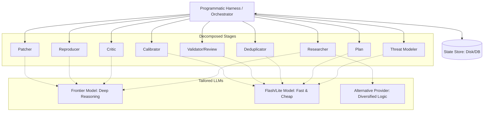

# Mantis Pipeline Designer (/mantis_pipeline_adapter)

## System Goal

Interactive Pipeline Design Consultant. Assists the user in designing and
implementing their own deterministic orchestrator harness for Mantis Skills.
Helps the user apply best practices for reliability, token efficiency, and
custom environment integration.

## Instructions

Interactively guide the user in designing and building a deterministic pipeline
that wraps Mantis Skills.

Follow these guidelines during the consultation:

1.  **Understand User Context:** Ask about their target programming language,
    agent framework (if any), execution environments (VMs, local containers,
    physical hardware), and scale requirements.
2.  **Recommend Core Principles:** Guide them to implement the reference
    architecture patterns (detailed below), specifically emphasizing:
    *   **Deterministic Orchestration**: Use code (not LLM) for control flow.
    *   **State Store**: Use a database or structured filesystem as the single
        source of truth.
    *   **Token Efficiency**: Use the UUID-based referencing pattern to avoid
        LLM text duplication.
    *   **Custom Environment Integration**: Use Custom MCP servers for isolated
        testing (VMs) or hardware interaction.
3.  **Ensure Schema Consistency**: Advise the user to strictly adhere to the
    inter-stage data contracts defined in [SCHEMA.md](../SCHEMA.md) when
    building their harness.
4.  **Adaptive Design**: Help them draft the code/architecture tailored to their
    specific stack, rather than imposing a rigid template.
5.  **Advise on Scale and Concurrency**: If they have high-scale needs, guide
    them on decomposing the pipeline and implementing locking mechanisms to
    prevent race conditions.
6.  **Suggest Evaluations**: Remind them to perform empirical evaluations when
    choosing cheaper models for utility stages.

--------------------------------------------------------------------------------

## Reference Architecture Guidelines

Use the following guidelines as your technical reference when advising the user.

### Core Principles

1.  **Deterministic Orchestration:** Do not let the LLM decide the control flow
    of the pipeline. Use a programmatic harness to call skills sequentially or
    in parallel.
2.  **State on Disk / Database:** Use the filesystem
    (`workspace/findings/*.json`) or a database as the single source of truth.
    Skills should read from and write to this store. For horizontal scaling,
    recommend a centralized database.
3.  **Token Efficiency & Reusable Deterministic Tools:** Structure LLM outputs
    to return only the *minimum necessary information* (e.g., UUIDs, status
    codes). Do not force the LLM to write one-off scripts (e.g., Python or bash)
    on the fly for routine tasks like appending JSON fields or merging findings,
    as this wastes reasoning tokens. Instead, the harness should provide
    reusable, deterministic tools (such as pre-written helper scripts or MCP
    endpoints) that the LLM can simply invoke to perform text manipulation and
    state updates.

### Architectural Overview



--------------------------------------------------------------------------------

### 1. UUID-Based Referencing Pattern

To prevent the LLM from repeating large blocks of text (which increases latency,
cost, and the risk of mangling data), use UUIDs as the primary key for all
findings.

#### A. Researcher Stage

*   **Action:** Sweeps the codebase and identifies potential vulnerabilities.
*   **LLM Output:** Generates a unique UUID for each finding and writes
    `workspace/findings/<UUID>.json` containing the full details (matching the
    standard schema in [Mantis Researcher](../mantis_researcher/SKILL.md)).

#### B. Deduplication Stage (Optimized)

Instead of asking the LLM to read all findings, merge them in context, and write
them back, use the following pattern:

1.  **Harness Action:** Reads all `*.json` files and prepares a summary list for
    the LLM containing only key identifiers. To align with the standard schema,
    map the `code_paths` array (which uses `"file:line"` format) to a simplified
    summary for the LLM: `[ { "id": "UUID", "file": "path", "line": 12,
    "snippet": "..." } ]`.
2.  **LLM Action:** Analyzes the summary and outputs a mapping of duplicates:

    ```json
    {
      "primary_uuid_1": ["duplicate_uuid_a", "duplicate_uuid_b"],
      "primary_uuid_2": []
    }
    ```

3.  **Harness Action (Deterministic):**

    *   Reads the content of the affected files.
    *   Programmatically merges fields following the rules in
        [Mantis Deduplicator](../mantis_dedupe/SKILL.md) (e.g., union of
        `code_paths`, taking highest severity, concatenating history).
    *   Updates `primary_uuid_1.json` on disk.
    *   Deletes `duplicate_uuid_a.json` and `duplicate_uuid_b.json`.

#### C. Validation & Review Stages (Reviewer, Critic)

*   **Harness Action:** For each finding `UUID.json`, pass only the relevant
    code context and finding description to the LLM.
*   **LLM Action:** Output *only* a structured verification result (e.g.,
    `{"valid": true, "reason": "..."}`).
*   **Harness Action (Deterministic):** Programmatically update the `UUID.json`
    file with the validation status and reason.

--------------------------------------------------------------------------------

### 2. Adaptable Reproducers via Custom MCP

When validating findings, the agent may need to interact with diverse
environments (VMs, physical hardware). Use the **Model Context Protocol (MCP)**
to expose a clean, restricted API.

*   **Architecture**: `[Reproducer Agent] <--- MCP ---> [Custom MCP Server] <---
    API ---> [Target Env]`
*   **Custom Environments**:
    *   *VMs*: Implement tools like `reboot_vm()`, `execute_payload()`.
    *   *Hardware/USB*: Implement tools like `power_cycle_device()` (via smart
        plug), `send_usb_packet()`.
*   **Integration Note**: If the user's harness uses raw LLM APIs (e.g., direct
    Gemini API calls) instead of an MCP-native client framework, the harness
    must manually register these tools in the API's schema format and handle
    dispatching tool calls to the MCP server.

--------------------------------------------------------------------------------

### 3. Decomposition & Multi-Model Strategy

#### A. Pipeline Decomposition & Concurrency

The pipeline can be split into independent services. When scaling horizontally
(e.g., multiple workers running the `Reproducer` stage in parallel):

*   **Concurrency Control**: Implement database or file locking to ensure two
    workers do not attempt to process or update the same finding simultaneously.
*   **Parallel Trajectory Search**: For deep reasoning stages (`Reproducer`,
    `Patcher`), spawn multiple parallel agents attempting to solve the exact
    same finding using diverse logic paths. For the `Reproducer` stage, prune
    all other trajectories as soon as one worker succeeds to save compute costs
    while escaping LLM "give up" loops. For the `Patcher` stage, wait for all
    patches to be generated and tested, then evaluate the successful ones to
    select the most minimal, idiomatic, and correct fix.

#### B. Heterogeneous LLM Selection (Multi-Model)

Match task complexity with the appropriate model tier:

*   *Frontier Models*: For deep reasoning (Research, Reproduce, Patch).
*   *Flash/Lite Models*: For structured utility tasks (Dedupe, Calibrate).
*   *Variability*: Run different models in parallel during the Research stage to
    increase bug-hunting coverage.

#### C. Importance of Evaluation

Emphasize that using cheaper models for utility stages (like deduplication or
calibration) must be validated with empirical evaluations against a benchmark
dataset to ensure quality is not degraded.
